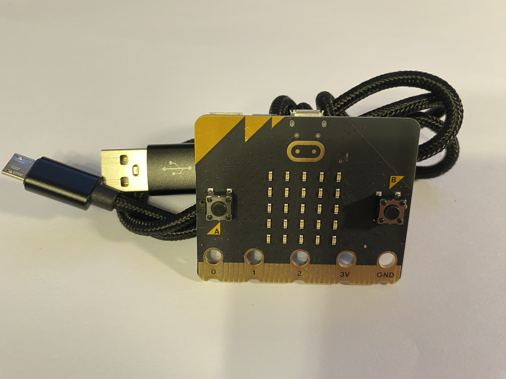
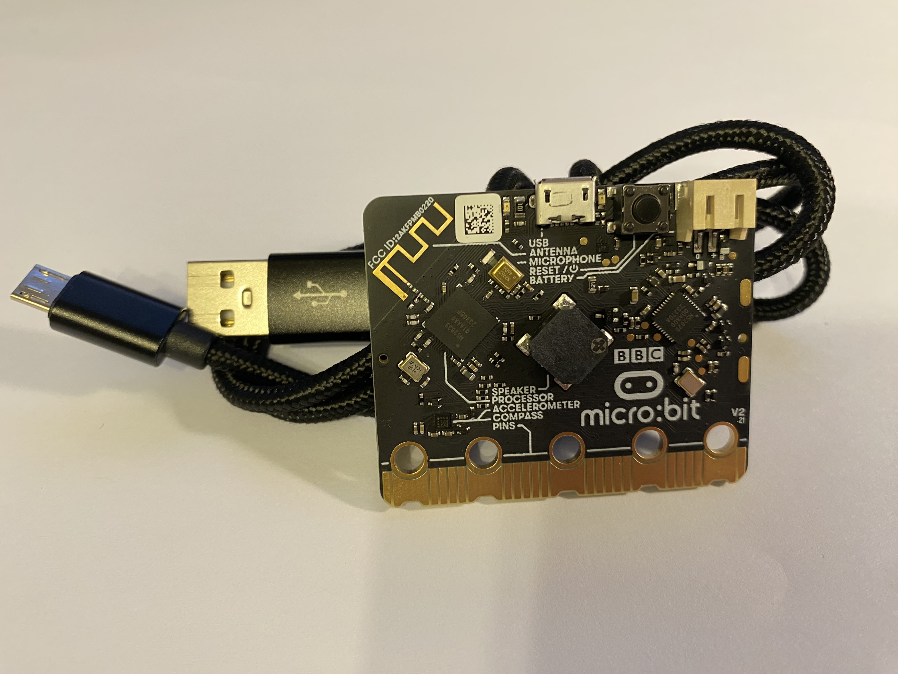

# 第1章 点亮第一个LED灯与Rust的爽点

"你作为编程新手，为什么要学Rust？"我在微信里问小小白。

我是一名有着30多年IT从业经验的老程序员，正在创作一本 Rust 编程入门书，致力于降低 Rust 那传说中陡峭的学习曲线。小小白是我最近在社交网络上认识的朋友，他对学习 Rust 充满热情。作为一名环境工程专业的硕士毕业生，小小白已在北京的一家公司工作三年。他渴望成为独立软件开发者，创造自己的软件，但编程经验有限。他在大学计算机基础课上学过 C 语言，后来也接触了一些 C++。研究生期间刚进课题组时，导师要求他用 Python 进行数据分析。他用 Jupyter 写过一些简短的 Python 代码，体验过代码即时运行、无需调试的便利。然而，他总觉得这不算**正儿八经地写程序**。

小小白向我诉说了他想学Rust的原因，这要从他最熟悉的已经使用了七八年的LaTeX排版标记语言说起。

# 1.1 Rust的爽点竟然不是内存安全

LaTeX 是一种基于 TeX 的文档排版系统，由莱斯利·兰波特（Leslie Lamport）于 1984 年开发。TeX 是唐纳德·克努斯（Donald Knuth）于1978年创建的一种功能强大的排版系统，广泛用于科学文献和复杂数学公式的排版，以其高度精确性和灵活性著称。LaTeX 通过引入一组宏包和高层次命令，将文档的结构与内容分离，简化了 TeX 的使用。它特别适合撰写需要统一格式和精美排版的文档，如学术论文、技术报告和书籍。尽管 LaTeX 的学习曲线较陡，但熟练掌握后，它能显著提高文档准备效率和排版质量。

在 LaTeX 生态系统中，宏（macro）是快捷、高度可定制的命令，可视为对一系列底层命令的封装或抽象。用户或开发者可以定义自己的宏命令，用于简化文档排版操作。宏包（package）则是一个功能集合，由许多预定义的宏命令组成。这些宏命令扩展了 LaTeX 的核心功能，帮助用户实现更复杂的排版需求。宏包的作用类似于现代编程语言中的库（library），但其核心仍依赖于"宏"这一基本构造。

小小白在使用 LaTeX 时发现了一个大坑：**宏包管理的用户体验不够好**。LaTeX 本身没有内置的宏包管理工具，这项功能依赖于 TeX 发行版（如 TeX Live 和 MiKTeX）。这些发行版提供了相应的包管理工具，但用户使用起来太过繁琐。

以 TeX Live 为例，它采用年度版本发行模式。每年发布一次新版本，升级到新版本时需要重新安装整个发行版，而不能通过包管理器 tlmgr（TeX Live Manager）直接完成，这是因为tlmgr 的功能仅限于在当前年份的发行版内管理宏包。这种设计是为了确保宏包与 TeX 引擎之间的兼容性，但也因此对动态更新需求较高的用户造成了一定的不便。

其次，CTAN（The Comprehensive TeX Archive Network，TeX和LaTeX相关资源的核心存储库网络，类似于Linux的软件仓库或Python的PyPI）上的宏包存在大量功能重叠。光是表格功能相关的宏包就有上百个，用户需要耗费大量时间来选择最适合的包。

另一个问题是宏包之间的兼容性。虽然可以通过查阅文档或向社区求助来解决冲突，但这个过程常常费时费力。

最近，小小白听说到开源社区推出了一种新的文字排版系统 Typst。这个用 Rust 开发的项目旨在挑战 LaTeX 的地位。Typst 这个名字巧妙地融合了"type"和"Rust"，体现了其对现代化排版的追求。目前，该项目在 GitHub 上已获得 35.2k 星标，广受关注。

小小白虽然对 LaTeX 的包管理有所不满，但因多年使用经验而对这款工具充满感情。当他得知 Typst 要挑战 LaTeX 时，便带着为 LaTeX 打抱不平的心态试用了 Typst。

令他吃惊的是，Typst 在编译速度和使用体验上的出色表现，让他从一个普通的“路人”变成了热情的“粉丝”。

Typst 内置了包管理器（借鉴了其开发语言 Rust 内置的包管理器 Cargo），无需依赖外部工具或额外配置就能管理包，大大简化了操作流程。相比之下，LaTeX 的包管理依赖于发行版（如 TeX Live 和 MiKTeX）的工具，且不同发行版的功能存在差异。

Typst 能自动解析文档依赖并按需安装缺失包，还支持一键更新所有包，免去了用户手动查找和安装的麻烦。而 LaTeX 则需要用户主动运行命令更新包，某些旧版本的发行版甚至无法安装最新的宏包。

此外，Typst 的包管理系统可以锁定特定的包版本，确保文档在不同环境下的排版一致性。而 LaTeX 缺乏统一的版本管理机制，用户可能会因系统或 TeX 引擎版本差异遇到宏包行为不一致的问题。

得益于工具链现代化设计，Typst 能自动处理包之间的兼容性问题。而 LaTeX 用户往往需要深入阅读宏包文档，甚至手动调整代码来解决冲突。Typst的这一改进显著降低了使用门槛。

Typst 采用按需下载模式，进一步提升了效率，避免了像 LaTeX 那样需要一次性安装大量宏包的问题（例如，TeX Live 的完整安装可达数 GB）。

另一个优势是 Typst 采用滚动更新机制，能快速采纳社区改进。相比之下，虽然 LaTeX 用户可以通过网络安装获取及时更新，但多数用户为了保持稳定性，仍然选择使用年度更新策略，这导致新功能普及速度较慢。

Typst 从设计之初就继承了 Rust 编程语言的优良传统——**注重工具链的现代化和超好的用户体验**，这使得 Typst 在新手友好性和易用性方面具有明显优势。尽管 LaTeX 拥有丰富的生态系统和成熟的功能，但其包管理系统仍是主要痛点。

根据国外知名编程问答网站 StackOverflow 2024年嵌入式开发调查统计，Rust 的包管理器和构建工具 Cargo 表现出色，83% 的受访者对其高度认可。这不仅体现了 Cargo 在嵌入式开发者中的良好口碑，还显示了其强大功能与易用性的完美结合。调查结果反映出嵌入式开发者对开发效率和使用体验的重视，同时也凸显了 Rust 在嵌入式开发领域日益提升的重要地位。

小小白因此意外发现了这个用户体验超好的 Typst 项目，进而对其开发语言 Rust 产生了浓厚兴趣。

与软件开发业界和社区对Rust内存安全特性的高度关注不同，小小白学习Rust的理由却让我感到既合理又新颖。Rust**好用的原生开发工具**和**清晰友好的编译错误提示**（小小白说LaTeX那些莫名其妙的报错信息能让九成新手望而却步，而一些国外程序员则表示C++的报错信息会让他们怀疑自己的能力），这些特性虽然在专业程序员、企业和政府部门眼中不如内存安全更具影响力，但对编程新手小小白而言，却恰恰是最重要的。

说到Rust的学习曲线，人们常说它很陡峭。持这种看法的，大多是有C++或Java编程背景的人。但对小小白这样的编程新手来说，**正因为知之甚少，反而成了优势**——因为学什么语言对他们来说都是从零开始。所以与那些已形成固定编程思维模式的C++或Java程序员相比，**小小白反而可能更容易掌握Rust**。

虽然我是计算机科班出身，但也曾和小小白一样是编程新手。我深知**初学者最需要的是新奇有趣的学习体验**。相比传统书本上枯燥的概念讲解，闪烁的嵌入式开发板LED灯和丰富多彩的游戏项目更能激发学习热情。让我们一起编写代码，通过点亮第一个LED灯来体验Rust的超好用户体验吧。

# 1.2 游戏前的准备

本书第一篇将带领你在micro:bit v2开发板（以后简称mb2）上用Rust玩各种有趣的游戏。只要连上插线板上的USB充电口，耀眼的"RUST"就能在这块巴掌大小的mb2开发板上滚动显示，**整天闪耀在桌子上**。这比在笔记本电脑终端里运行一个简单的字符串程序，然后合上屏幕就忘记要有趣得多吧？不妨看看图1体会一下。


图1-1 用Rust在mb2开发板上滚动显示“RUST“

第一篇的这些游戏都属于一个专业领域：嵌入式开发。什么是嵌入式开发？

## 1.2.1 嵌入式开发

嵌入式开发指**为专用硬件设备编写软件的过程**。这类设备通常具有**特定功能**，且**资源受限**（如内存和处理能力），目的是在成本与功能之间取得最佳平衡。常见的嵌入式系统包括家电（如洗衣机）、汽车控制系统和智能手表等。

嵌入式开发的历史可以追溯到二十世纪六十年代的阿波罗登月制导计算机，以及用于民兵 I NS-1OQ导弹制导系统的D-17B计算机。

让我们来探索嵌入式系统的独特魅力。这些小巧精致的设备就像专注的工匠，各自承担着独特的使命。虽然资源有限，如同居住在小屋中，却能在有限空间里发挥惊人的效率。它们的反应速度尤其令人称奇，像赛车手一样能在瞬间做出精准的判断和响应。

这些小设备需要严格遵循硬件的"规矩"，但正是这种约束让它们更加可靠。它们就像尽职的守夜人，日复一日地工作，始终保持警惕。

嵌入式系统的优势显著：它们不仅高效完成任务，还特别节能环保。体型小巧让它们能轻松融入各种场景，实惠的价格则让更多人能享受科技带来的便利。

当然，这个领域也面临挑战。开发者需要同时掌握软件和硬件知识，就像学习一门复杂的手艺。调试问题时，常常需要解决没有完整线索的谜题，考验耐心和智慧。由于设计时就定位明确，增加新功能并不容易。资源管理则像一场精细的平衡游戏，需要优化每一分资源。

嵌入式系统的应用无处不在：从家电、智能音箱到工厂自动化设备，从汽车智能系统到城市物联网设备，甚至医疗领域的精密仪器。这些都证明了科技如何改变我们的生活。

嵌入式开发将硬件设计和软件开发融为一体，特别适合那些对电子设备运行机制感兴趣、热衷动手实践的开发者。

2015年Rust发布1.0版本后，凭借易用的工具链、出色的内存安全性和与C语言相当的性能，赢得了嵌入式开发者的青睐。

Rust在嵌入式开发中表现出色，就像一位能干的管家。它不仅让代码运行安全高效，还特别善于照顾资源有限的设备。它为设备提供了防护，减少内存错误，同时用最轻便的方式完成复杂任务。

这位管家的过人之处体现在多个方面：它能在代码运行前就发现潜在危险，无需庞大的操作系统就能工作，这对空间有限的设备来说极其重要。它还提供了一套现代化的开发工具，让开发过程更加顺畅。

Rust的优势显著：它不仅确保代码安全，还能简化复杂操作，同时保持高效性能。它就像经验丰富的工程师，既能写出优雅的代码，又能充分利用稀缺的资源。

当然，Rust也有其挑战。学习过程需要时间和耐心，就像掌握一门复杂的手艺。它的生态系统仍在成长，编译时间可能稍长，但这是为了确保代码质量的必要付出。

Rust特别适合要求高安全性的领域，如医疗设备和航空系统。它的轻量级特性使其在物联网设备中广受欢迎，高效性能则满足了实时系统的需求。在教学领域，它也成为培养新一代开发者的理想选择。

Rust在嵌入式开发中既保持现代思维又尊重传统，掌握后能帮助我们创造更安全、更可靠的嵌入式系统。

让我们做好准备，开启这段精彩的旅程吧！用Rust代码点亮第一个LED灯，迈出嵌入式开发的第一步！

## 1.2.2 调整心态

小小白在探索嵌入式编程之旅时应该如何调整心态？作为过来人，我认为最重要的是学会**接纳自己在编程踩坑时产生的恐惧感——就像站在小河边，平静地看着代表恐惧的树叶缓缓飘过，而不是掉进河里**。

这种恐惧感是成长的必经之路。回想这几十年的编程经历，我常常被命令行和日志中莫名其妙的错误信息折磨，甚至怀疑过自己的能力。但每当通过深入思考，或借助专家、搜索引擎和AI找到解决方案时，就会感到无比自豪。所以小小白，当你在编程之路上遇到类似困境时，我反而为你感到高兴。因为当你靠自己的努力爬出这些"坑"时，就意味着你向真正的程序员迈进了一大步。加油！

## 1.2.3 点亮第一个LED灯极简路线图

| 步骤 | 描述 |
| --- | --- |
| 1. 准备硬件 | 准备mb2开发板及USB micro数据线 |
| 2. 安装软件 | 安装Rust |
| 3. 生成代码 | 用`cargo generate`生成点亮LED灯代码 |
| 4. 交叉编译 | 安装目标平台：`rustup target add thumbv7em-none-eabihf`<br>交叉编译：`cargo build`<br> |
| 5. 烧录运行 | 安装烧录工具probe-rs<br>烧录运行：`cargo run` |
| 6. 解读代码 | 通用Rust项目包管理文件：Cargo.toml和Cargo.lock<br>Cargo工具行为和项目构建环境配置文件：.cargo/config.toml<br>嵌入式开发特定配置文件：Embed.toml<br>Rust源代码入口文件：src/main.rs |

## 1.2.4 准备硬件

要点亮第一个LED灯，首先需要一台**计算机**——台式机或笔记本均可。计算机需要安装 Linux、macOS 或 Windows 10/11 这三类操作系统之一。在撰写本书时，我使用了三台安装不同操作系统的计算机：Ubuntu 24.04.1 LTS、macOS Sonoma 15.1.1 和 Windows 11 Pro 23H2。由于篇幅所限，本书接下来的内容将围绕这三种操作系统展开。如果你使用的是其他操作系统，可以参考本书内容，并向你喜欢的 AI 助手寻求帮助。

🔎 如果你有兴趣，也可以在Windows上安装微软的WSL 2来使用Linux进行开发，这是本书暂不讨论的可选的进阶选项。

由于本书第一篇涉及嵌入式开发内容，建议使用Linux系统，它提供了更完善的嵌入式开发工具链。不过放心，对于本书所有内容，使用Windows或macOS系统也完全可以。

接下来，让我介绍一个有趣的设备——**mb2开发板**，如图1-2和1-3所示。



图1-2 mb2正面展示了5×5的LED点阵和两侧的按钮



图1-3 mb2背面展示了产品名称、几块芯片和复位按钮，图中还有一根USB micro数据线

这要从英国广播公司（BBC）的一群富有创意的工程师说起。看到许多孩子沉迷手机游戏却对科技创造毫无兴趣，他们萌生了一个想法：何不设计一个简单有趣的小工具，让孩子们也能体验创造的乐趣？这就是micro:bit v1的由来。2015年，这个小设备作为特别礼物，送到了一百万名英国中学生手中。出乎意料的是，它广受欢迎，很快流传全球。

五年后，升级版mb2问世了。这个不足名片大小的"魔法盒子"装载了丰富的功能：一块LED点阵显示屏，两个按键，以及多种环境传感器。最引人注目的是它的核心——Nordic nRF52833芯片，不仅支持蓝牙通信，还具有出色的能效比。

对编程初学者而言，micro:bit是理想的入门工具。你可以从图形化编程开始，然后过渡到Python，最后尝试Rust。只需一根USB线和一台电脑就能开始创作，整个过程如同搭积木般直观。不过别担心，条条大路通Rust，使用本书学习Rust并不需要先掌握Python。

这个小设备的魅力在于它让学习充满乐趣。无论是制作闹钟还是测量房间温度，都能轻松实现。更棒的是，全球有众多同好在分享创意，让你在学习路上永不孤单。

当然，micro:bit也有其限制：它不能运行复杂程序，也不适合工业应用。不过，这反而成了它适合初学者的优点——简单的功能让人能专注于创造的快乐。而且，它的价格也很亲民，在网上买一块的花费，也就相当于两三杯咖啡。

因此，无论你是正在学习编程的学生、想带孩子体验创造乐趣的家长，还是希望尝试开发简单智能设备的爱好者，micro:bit都是理想选择。它就像一把开启创意世界的钥匙，轻轻一转，便能带你进入奇妙的编程世界。

此外，你还需要一根普通的**USB micro数据线**，用于连接计算机USB接口和mb2的USB接口。购买mb2时通常会附赠这根数据线。

新购买的mb2开发板通常都能正常工作，不过做个测试会更让人安心。幸运的是，测试过程非常简单，因为测试代码已经准备好了，无需自己编写。

✅如何验证新购买的micro:bit能正常工作？

可以访问[micro:bit官方在线编辑器](https://python.microbit.org/v/3)编写Python代码，然后一键将程序**烧录（flash）**到开发板。通过让mb2的LED灯闪烁、显示爱心图案并显示"Hello"问候语，就能验证开发板是否正常工作。

🔎**烧录**是指将编译好的程序写入嵌入式设备（如开发板或单片机）的存储器（通常是闪存 Flash）中的过程。这就像往 U 盘里拷贝文件一样，通过工具将程序传输到设备中，设备随后会按照程序的指令运行。

烧录这个名字来源于闪存存储器（Flash Memory）的工作原理。Flash 是一种非易失性存储器，即使断电也能保存数据。写入数据时，存储器单元会经历电流加热和数据写入的过程，类似于"烧写"。在早期的嵌入式开发中，存储器写入过程较为复杂，使用电流"擦除"数据的阶段像是用火"烧"掉旧数据，因此被称为"烧录"或"烧写"。尽管现代工具已让这个过程变得简单，但这个名称仍在沿用。

为什么嵌入式开发需要烧录？这是因为嵌入式设备不同于普通电脑，没有硬盘或操作系统。程序必须写入设备的闪存中，这样设备启动时才能运行代码。简单来说，烧录就是"给设备安装软件"的过程。

⚠️ 我烧录好一块开发板，拔下USB线断电后，下次还需要再次烧录才能让LED灯重新闪烁吗？不需要。程序一旦烧录就会保存在 mb2 的非易失性存储器（Flash 存储器）中，即使断电也不会丢失。只要接入电源（可以是电脑、充电器或插线板的 USB 接口），程序就会自动运行，无需重新连接计算机。另外，你也可以用电池盒给 micro:bit 供电。

🔎mb2 不像传统设备那样运行操作系统——如 Linux 或 RTOS（ Real-Time Operating System，实时操作系统），而是让烧录的程序直接在硬件上运行。当使用 MicroPython 编程时，开发板会包含一个 MicroPython 解释器，这是一个精简的运行时环境。而使用 Rust 或其他语言编译的固件（firmware）则是板上唯一的软件系统。固件是一种特殊的程序，它直接嵌入硬件设备中，负责控制基本硬件操作，并充当设备与其他软件系统之间的桥梁。固件存储在设备的非易失性存储器（如 Flash 存储器）中，断电后不会丢失。作为"嵌入式"软件，固件的更新频率较低，一般不需要像通常意义上的软件那样经常更改。

## 1.2.5 安装软件

要点亮第一个LED灯，还需要在终端（terminal）里运行命令。终端是程序员最常用的工具，但编程新手往往很少接触，甚至从未打开过。许多新手担心自己记不住各种命令，看到终端里的错误提示就头疼。其实，即使专业程序员也不会记住所有命令，他们只是善于使用终端工具来查找所需的命令（本书后面会详细介绍）。遇到看不懂的错误提示也不必气馁，这往往是因为提示信息本身写得不够清晰。值得一提的是，Rust在这方面做得特别好，它的错误提示比其他编程语言更容易理解，这一点我们稍后就能体会到。

秉持"学一点用一点"的原则，我会从操作系统自带的软件讲起，随着内容深入再逐步介绍其他需要安装的软件。表1-1列出了我点亮第一个LED灯所用的命令行shell（这是一种与计算机"对话"的软件工具，就像计算机的外壳，让你能通过输入文字命令来执行特定任务，而不是点击图标）终端的版本（注意，这些版本都是我在写这本书时的较新版本，不是最低要求版本）。如果你的软件版本与表中不同，可以先按照本书操作试试看，一般都不会有问题。遇到问题时，你可以寻求AI助手帮助。

表1-1 点亮第一个LED灯所用的命令行shell终端的版本号

| **Ubuntu 24.04.1 LTS上的bash**  | **macOS Sequoia 15.1.1上的zsh** | **Windows 11 Pro 23H2上的CMD** |
| --- | --- | --- |
| bash 5.2.21(1)-release (x86_64-pc-linux-gnu)<br># 查看shell类型<br>`echo $SHELL`<br># 如何查看版本号<br># 按窗口键 → 搜“Terminal” → 点击Terminal打开 → 输入命令`bash --version` | zsh 5.9 (arm-apple-darwin22.1.0)<br># 查看shell类型<br>`echo $SHELL`<br># 如何查看版本号<br># 按Command + 空格键打开spotlight → 搜“Terminal” → 点击Terminal打开 → 输入命令`zsh --version` | cmd (Command Prompt) 10.0.22631.4541<br># 如何查看版本号<br># 屏幕底部任务条→Search框→搜“command prompt” → 打开command prompt → 输入命令`ver` |

✅根据表1-1中的提示，请打开终端窗口，并输入对应你操作系统的命令来查看命令行shell版本号，以验证shell是否正常工作。

**安装Rust**

要编写Rust代码点亮第一个LED灯，当然需要安装Rust。Rust是一种现代系统编程语言，以性能和内存安全著称。它通过独特的所有权机制防止内存错误，实现"无畏并发"和高效可靠的软件开发。2003年的SQL Slammer蠕虫事件暴露了C/C++的内存安全问题，为Rust的诞生埋下伏笔。2006年，Graydon Hoare受电梯系统崩溃的启发，开始开发以内存安全为核心的Rust语言。2010年，Mozilla公司开始孵化Rust，语言逐渐成熟，并于2015年发布1.0版本，开启了追求高性能与内存安全并重的新篇章。Rust独特的设计深受开发者欢迎，连续九年在StackOverflow最受喜爱编程语言评选中位居榜首。随着亚马逊、谷歌、Facebook和微软等科技巨头的广泛采用，Rust不仅撼动了C/C++的地位，还通过参与Linux内核开发和突破行业标准，成为新时代安全编程的典范。

✅要运行本书的代码，你需要先安装Rust工具链。请按照表1-2的说明来安装（如果英文网页难以阅读，建议安装浏览器翻译插件，我使用的是Immersive Translate）：

表1-2 Rust安装要点

| **在Ubuntu上安装Rust**  | **在macOS上安装Rust** | **在Windows上安装Rust** |
|--- | --- | --- |
| # 查看rust编译器版本（检查是否已安装）<br>`rustc --version`<br># 安装rust<br>（请参考Rust官网安装页面）<br># 参考网页<br>https://www.rust-lang.org/tools/install<br># 列出已安装的工具链<br>`rustup toolchain list`<br>`rustup show`<br># 若很久前已安装则可升级工具链 和 rustup本身<br>`rustup update` | （同左） | # 在rust官网下载页面下载 rustup-init.exe，然后在文件管理器中用鼠标双击安装<br># 参考网页<br>https://www.rust-lang.org/tools/install |

✅安装完成后，打开终端，运行以下命令验证安装是否成功：

```bash
rustc --version
```

如果显示类似下面的Rust编译器版本号，则表明Rust工具链安装成功。

```bash
rustc 1.82.0 (f6e511eec 2024-10-15)
```

## 1.2.6 Rust能工作吗

在开始编写Rust代码点亮LED灯之前，我们需要先验证Rust是否能正常工作。按照编程界的传统惯例，让我们从编写一个Rust版的"Hello, world!"程序开始。不过，你可能会问："Hello, world!"究竟是什么？

"Hello, world!"是程序员学习新编程语言时编写的第一个程序。这个简单的程序就像向编程世界挥手致意的第一声问候。虽然它只在屏幕上显示一行问候语，却能帮助我们验证开发环境是否正常工作，同时让我们初步了解编程语言的基本语法。

这个传统有着有趣的历史渊源。在1970年代，计算机科学先驱布莱恩·柯尼汉（Brian Kernighan）和丹尼斯·里奇（Dennis Ritchie）在他们的著作《The C Programming Language》中首次引入了这个示例。从那时起，这个简单的程序就像一颗种子，在编程世界生根发芽，成为了每位程序员学习新语言时的必经之路。

"Hello, world!"之所以广受欢迎，不仅因为它简单易懂，更因为它传递着积极向上的信息——就像踏上新旅程时的第一声问候，充满希望和期待。

在50年前，编写"Hello, world!"需要打开编辑器，一个字符一个字符地敲入代码。而在今天工具链发达的时代，我们可以让工具帮我们完成这项工作。

✅要验证Rust能否正常工作，请打开终端，进入你的用户主目录（通常只需在终端中输入`cd`命令即可进入）。然后运行以下命令，让Cargo为我们创建一个"Hello, world!"程序（注意：以`#`开头的是注释行，用于说明命令的用途，你无需输入这些注释）：

```bash
# 进入用户主目录
cd
# 创建名为hello-world的新项目
cargo new hello-world
```

这个命令会创建一个包含"Hello, world!"程序的Rust新项目，为你开启编程之旅。

✅让我们运行以下命令来查看源代码目录结构：

```bash
# 进入hello-world文件夹
cd hello-world
# 在Linux或macOS的终端里查看源代码目录结构，
# -a表示列出所有文件和文件夹（包括隐藏的）
tree -a
# 在Windows的cmd里查看源代码目录结构
tree /F
```

这个Rust新项目的目录结构如下所示：

```bash
.
├── .git
（其他行略）
├── .gitignore
├── Cargo.lock
├── Cargo.toml
└── src
    └── main.rs

11 directories, 9 files
```

在本章中，我们只需要关注目录结构中的main.rs文件。如果你回答不了下面带🧠图标的问题，可以询问你喜欢的AI助手，以后不再赘述。

🧠 `cargo new`命令所创建.git文件夹、.gitignore文件和Cargo.toml文件分别是作什么用的？

💡注意：`.git`文件夹和`.gitignore`文件都是隐藏的。在Linux或macOS终端中使用`ls`命令，或在Windows cmd终端使用`dir`命令时，默认不会显示它们。要查看这些隐藏文件，需要添加特定参数：Linux/macOS使用`ls -lFa`，Windows使用`dir /a`。

当你运行 `cargo new` 命令创建一个新的 Rust 项目时，src 文件夹会自动生成。这个文件夹的名字是 source 的缩写，表示“源代码”。所有与你的程序逻辑相关的代码都会存放在这个文件夹中。换句话说，这是你的项目的“大脑”，所有的代码工作都会集中在这里完成。src 文件夹就像你的项目的“工作室”，你的程序代码都在这里被设计和实现。

在 src 文件夹里会自动生成一个叫做 main.rs 的文件。这个文件是你的程序的“入口点”，也就是程序开始运行时第一个执行的地方。

✅要想查看main.rs文件中的代码，可以在终端里继续运行下面的命令：

```bash
# 在Linux或macOS的终端里查看src目录下main.rs中的源代码
cat src/main.rs
# 在Windows的cmd里查看src目录下main.rs中的源代码，
# 注意cmd中要用反斜线
type src\main.rs
```

main.rs里面包含一段默认代码。我在代码中添加了以`//`开头的注释行来解释代码的作用。这些注释并非工具自动生成，添加与否不会影响程序的运行：

```bash
// 定义一个主函数 `main`，这是 Rust 程序的入口点。
// 当你运行这个程序时，从这里开始执行代码。
fn main() {
    // 使用 `println!` 宏在控制台输出一行文字。
    // 这里输出的是 "Hello, world!"。
    // 注意：`println!` 是一个宏（以 `!` 结尾），它和普通函数不同，
    // 可以用来执行一些更复杂的代码生成。
    println!("Hello, world!");
}
```

这段代码的意思是，当你运行程序时，屏幕上会打印出“Hello, world!”这句话。main.rs 文件是每个 Rust 项目必不可少的部分，如果没有它，程序就无法启动。main.rs 就像一本书的“目录”或“开头”，告诉程序从哪里开始运行。

✅要运行这个程序，请在终端中继续执行以下命令：

```bash
cargo run
```

如果你能看到以下运行输出，那么恭喜你，你已经成功迈入Rust编程的世界！

```bash
Hello, world!
```

✅运行程序后，让我们再次执行`tree`命令，看看项目目录结构发生了哪些变化：

```bash
.
├── .git
（其他行略）
├── .gitignore
├── Cargo.lock // 新增
├── Cargo.toml
├── src
│   └── main.rs
└── target // 新增
（其他行略）
    └── debug
（其他行略）
21 directories, 36 files
```

运行程序后，项目的目录和文件数量明显增加了。在本章中，我们只需要关注新增的三个关键部分：Cargo.lock文件、target文件夹和target/debug文件夹。

🧠 运行`cargo run`命令后新增的Cargo.lock文件、target文件夹和target/debug文件夹各自的用途是什么？

⚠️如果你想删除`cargo run`命令产生的所有文件和文件夹，使项目回到初始状态后再重新运行，可以使用以下命令：

```bash
cargo clean
```

现在再次运行tree命令，检查一下目录结构是否已恢复到初始状态。

# 1.3 点亮左上角第一个LED灯

完成了Rust版的"Hello, world!"程序后，让我们正式踏入Rust嵌入式编程的世界——我们将编写一段Rust代码，点亮mb2正面5×5 LED点阵中左上角的第一个LED灯。

## 1.3.1 生成代码

如何编写点亮第一个LED灯的Rust代码呢？编写代码就像写文章一样——我们可以先参考他人的作品，然后加以修改，就能完成自己的作品。在这里，你不用到处找参考代码，因为我已经准备好了一份示例代码。

✅接下来，你只需要执行以下命令：先安装[代码生成工具cargo-generate](https://github.com/cargo-generate/cargo-generate)，然后用这个工具从[我的GitHub模版代码仓库](https://github.com/wubin28/mb2-led-template)生成一份代码。有了这个基础，稍作修改就能完成你自己的程序了。

```bash
# 安装cargo-generate代码生成工具
cargo install cargo-generate
# 根据我在GitHub上的模版代码生成一份新代码
cargo generate wubin28/mb2-led-template
# 当工具提示输入Project Name时，随便输入一个项目名即可，比如lu1l，表示Light Up 1st Led
# 进入这个新创建的项目目录
cd lu1l
```

⚠️如果你由于各种原因无法运行上面的`cargo generate`命令，也不用担心。你可以直接在[https://github.com/wubin28/learn-rust-by-games(https://github.com/wubin28/learn-rust-by-games)]代码库的ch01文件夹下找到`lu1l`文件夹，里面已经包含了生成好的代码。

## 1.3.2 编译代码

✅如果你只是想编写在自己电脑上运行的普通程序，而不是为mb2开发板编写嵌入式程序，那么生成代码后，可以直接用以下命令来编译（这会将你的代码转换成操作系统能理解的格式）：

```bash
cargo build
```

⚠️当我们运行上述编译命令来编译针对mb2的嵌入式Rust代码时，会遇到第一个障碍。你将看到以下错误信息（注意：下面第一行开头的`$` 是命令行提示符，用于区分命令和输出，输入命令时不要包含它）：

```bash
$ cargo build
     Locking 1 package to latest compatible version
      Adding lu1l v0.1.0 (/home/<username>/lu1l)
   Compiling semver-parser v0.7.0
   （其他行略）
   Compiling cortex-m-rt v0.7.5
error[E0463]: can't find crate for `core`
  |
  = note: the `thumbv7em-none-eabihf` target may not be installed
  = help: consider downloading the target with `rustup target add thumbv7em-none-eabihf`

For more information about this error, try `rustc --explain E0463`.
error: could not compile `nb` (lib) due to 1 previous error
warning: build failed, waiting for other jobs to finish...
error: could not compile `critical-section` (lib) due to 1 previous error
```

这是我们首次遇到Rust编译器的报错信息。让我们看看这些信息是否容易理解。

错误信息显示"the `thumbv7em-none-eabihf` target may not be installed"，表示名为`thumbv7em-none-eabihf`的目标平台尚未安装。编译器给出了一个友好的提示，建议运行`rustup target add thumbv7em-none-eabihf`命令来安装。这里有几个问题值得思考：什么是目标平台？编译器是如何检测到`thumbv7em-none-eabihf`未安装的？而且，`thumbv7em-none-eabihf`这个特殊名称中的三个部分各自代表什么含义？

**什么是目标平台？编译器如何知道 thumbv7em-none-eabihf 目标未安装？**

当我们谈论目标平台时，实际上是在讨论程序将在哪里运行。就像一本书需要合适的书架，程序也需要合适的运行环境。这个环境主要包含两个关键部分：硬件架构和操作系统。硬件架构是计算机的"大脑"类型，可能是x86、ARM或其他类型。操作系统则像是管理这个"大脑"的"物业公司"，可以是我们熟悉的Windows、Linux、macOS，也可以是像micro:bit这样直接在硬件上运行的特殊环境——这种情况就好比没有物业公司，一切需要自己管理。

✅在这个项目中，.cargo/config.toml 文件的第2行明确指定了 `thumbv7em-none-eabihf` 作为目标平台。可以运行`cat`（适用于Linux或macOS）或`type`（适用于Windows）命令查看这个文件的内容：

```toml
[build]
target = "thumbv7em-none-eabihf"
# 其他行略
```

上面这两行配置指定了全局编译目标为 `thumbv7em-none-eabihf`。这告诉 cargo，所有构建操作（包括 cargo build 和 cargo run）都将针对这个目标平台进行。Rust 编译器会生成适配 ARM Cortex-M4 处理器内核的代码（[该内核位于 mb2 开发板背面左侧的 Nordic nRF52833 微控制器芯片内](https://tech.microbit.org/hardware/)，如图1-4所示），让程序直接运行在 mb2 的硬件上，而不是生成面向常规桌面平台的代码。最终生成的二进制文件会存放在 target/thumbv7em-none-eabihf/ 文件夹中。


图1-4 ARM Cortex-M4 处理器内核位于 mb2 开发板背面左侧的 Nordic nRF52833 微控制器芯片内

🔎mb2 开发板、Nordic nRF52833 微控制器（MCU，microcontroller unit）和 ARM Cortex-M4 处理器内核是如何组合在一起的？

mb2 是一款教育用微控制器开发板，其核心是 Nordic nRF52833 微控制器芯片。可以把Nordic nRF52833 微控制器比作mb2开发板的“大脑”。

Nordic nRF52833 微控制器是一款系统级芯片（SoC，System on Chip），由 Nordic Semiconductor 公司制造。它不仅集成了 ARM Cortex-M4 处理器核心作为其"大脑"，还配备了蓝牙 5.0、2.4GHz 无线通信和 NFC 功能，并提供丰富的外设接口。

ARM Cortex-M4 是一款由全球领先的处理器架构设计公司 ARM 设计的 32 位微处理器核心，它具备硬件浮点运算单元（FPU，Floating-Point Unit）和 DSP 指令集，在 nRF52833 中以 64MHz 的频率运行。

这三者形成了一个层层嵌套的结构：mb2 开发板采用 Nordic nRF52833 作为主控芯片，而 nRF52833 内部则使用 ARM Cortex-M4 作为处理器核心。这种设计使 mb2 不仅具备强大的计算能力，还拥有现代化的无线通信功能。

**`thumbv7em-none-eabihf` 这个目标平台名称中的各个部分代表什么含义？**

`thumbv7em-none-eabihf` 这个目标三元组包含以下几个部分：

- `thumb` - 表示 ARM 的 Thumb 指令集，这是一套精简高效的指令系统。相比标准 ARM 指令，它体积更小、效率更高，特别适合嵌入式系统。
- `v7em` - 指定 ARMv7E-M 架构，[这是 ARM Cortex-M4 处理器内核使用的架构](https://en.wikipedia.org/wiki/ARM_Cortex-M)。
- `none` - 表示程序将直接与硬件通信（裸机环境），不需要像 Windows 或手机那样的操作系统作为中介。
- `eabi` - 即 Embedded Application Binary Interface（嵌入式应用二进制接口），它定义了程序与硬件和库交互的规则，包括函数调用和内存布局等。这个接口专为资源受限的嵌入式设备优化。
- `hf` - 表示 Hardware Floating-point（硬件浮点运算支持），意味着处理器内置了专门的浮点运算单元，可以更快地处理小数计算。

简而言之，这个编译错误的原因很简单：我们试图为 micro:bit 的目标平台（即 `thumbv7em-none-eabihf`）编译代码，但这个平台还未安装在我们的系统中。

✅理解了这个错误后，让我们运行以下命令来安装目标平台，使编译器能进行**交叉编译**（cross-compilation，即在Linux、macOS或Windows上编译程序，让它能在mb2开发板上运行。由于第一篇中的编译都针对mb2开发板，为简洁起见，本篇后文提到的编译均指交叉编译）：

```bash
rustup target add thumbv7em-none-eabihf
```

⚠️注意：只需要安装一次目标平台，之后编译和运行程序时无需重复安装。

安装完后，还可以运行下面的命令列出所安装的目标平台，会看到`thumbv7em-none-eabihf`目标平台已经安装好了，如下所示：

```bash
$ rustup target list --installed
thumbv7em-none-eabihf
x86_64-unknown-linux-gnu
```

之后，就可以再次运行编译构建命令：

```bash
cargo build
```

如果你看到命令输出的最后一行像下面这样，就表示编译成功了：

```bash
Finished `dev` profile [unoptimized + debuginfo] target(s) in 20.29s
```

## 1.3.3 运行代码

✅此时可以执行下面的命令来运行代码：

```bash
cargo run
```

上面这个运行代码的命令会先"构建"程序（等同于 `cargo build`），然后"运行"它。对于 mb2，运行程序比在普通计算机上更复杂，因为需要通过调试工具（如 J-Link 或 probe-rs 的 cargo-embed 插件）将生成的程序文件烧录（flash）到 mb2 的存储器中。

⚠️果然不出所料，当要向mb2开发板烧录程序时，下面的错误信息表示我们踩到了新坑：

```bash
$ cargo run
    Finished `dev` profile [unoptimized + debuginfo] target(s) in 0.03s
     Running `probe-rs run --chip nRF52833_xxAA target/thumbv7em-none-eabihf/debug/lu1l`
error: could not execute process `probe-rs run --chip nRF52833_xxAA target/thumbv7em-none-eabihf/debug/lu1l` (never executed)

Caused by:
  No such file or directory (os error 2)

```

这段错误信息包含两个关键部分：error（错误）和 caused by（原因）。简单来说，系统在尝试执行 `probe-rs run --chip nRF52833_xxAA` 命令时，找不到所需的文件或目录，导致无法运行。这通常意味着 `probe-rs run` 命令的相关文件缺失、路径有误，或者工具未正确安装。这个错误引发了几个值得思考的问题：当我们执行 `cargo run` 时，Rust工具链是如何知道要运行 `probe-rs run --chip nRF52833_xxAA` 命令的？`probe-rs run` 命令具体是什么？`nRF52833_xxAA` 又表示什么？既然编译时使用的是 `thumbv7em-none-eabihf` 目标平台，为什么运行时会用到 `nRF52833_xxAA` 呢？

**🧠当我们执行 `cargo run` 时，Rust工具链是如何知道要运行 `probe-rs run --chip nRF52833_xxAA` 命令的？**

在 .cargo/config.toml 文件中设置 runner 为 `probe-rs run` 后，`cargo run` 会自动调用 `probe-rs run`。让我们再看看这个文件的内容：

```bash
# 其他行略

[target.thumbv7em-none-eabihf]
runner = "probe-rs run --chip nRF52833_xxAA"
# 其他行略
```

这两行配置指定了运行 `cargo run` 时要使用的命令。`runner` 是 Cargo 的内置配置选项，用于告诉工具链如何运行目标二进制文件。`--chip` 参数指定目标 MCU 的芯片型号，让 probe-rs 工具能正确识别并与硬件设备交互。运行 `cargo run` 时，Cargo 不会直接运行生成的二进制文件，而是调用指定的 runner 命令。在这里，`probe-rs run --chip nRF52833_xxAA` 作为 runner，负责将程序烧录到 nRF52833 芯片中并运行。

**🧠`probe-rs run` 命令具体是什么？**

`probe-rs run` 是由 probe-rs 工具提供的命令，用于将编译好的程序烧录到嵌入式设备（如 mb2）的存储器中并运行程序。它可以替代专有工具（如 J-Link）来烧录和调试程序。

probe-rs 是一个用 Rust 编写的开源工具，为嵌入式开发者提供跨平台、开源、易用的烧录和调试解决方案。它支持多种调试探针（debug probes），如 CMSIS-DAP 和 J-Link，并兼容众多嵌入式芯片和开发板。

probe-rs 支持 Linux、macOS 和 Windows 等主流操作系统。它在 GitHub 上开源，开发者可以自由修改和扩展。它追求简单易用，避免了专有工具的复杂配置和生态锁定。它与 Rust 嵌入式生态深度集成，支持 SWD 和 JTAG 调试接口，兼容 STM32、nRF52 等多种 MCU。开发者可以通过 probe-rs run 或 cargo-embed 烧录代码，也可以用 probe-rs debug 或 IDE 集成进行调试。

probe-rs 由 Rust 嵌入式开发者社区发起，旨在为开源生态提供一个替代专有工具的解决方案。不同于需要商业授权的 J-Link，probe-rs 的开放性获得了开源社区的广泛支持。

🔎J-Link 是 SEGGER 公司开发的专有调试工具，在嵌入式开发领域广受欢迎。SEGGER 专注于嵌入式开发工具和软件，其产品广泛应用于工业和消费电子领域。许多 MCU 厂商都推荐使用 J-Link 作为官方调试工具。

J-Link 通过 SWD 或 JTAG 接口与嵌入式设备连接，用于程序烧录、调试和跟踪。作为一款硬件调试探针，它需要配合 SEGGER 公司的软件（如 J-Link Commander 和 Ozone）使用。它具有极快的烧录速度和低延迟调试特性，支持几乎所有主流 MCU 平台（如 STM32、nRF、NXP 系列），特别适合专业开发场景。作为嵌入式开发中的标准调试工具，J-Link 支持实时跟踪（RTT）和性能分析等高级功能。

J-Link 的软件和协议都是闭源的，开发者必须遵守严格的授权条款。其专业版需要付费，免费版本的部分功能受到限制。

**🧠`nRF52833_xxAA` 又表示什么？**

nRF52833_xxAA 是目标MCU的具体型号。前面讲过，mb2开发板的“大脑”就是Nordic nRF52833 微控制器。后缀 _xxAA通常用于指定芯片的封装和版本：

- xx - 未特别指定的通用芯片版本。
- AA - 代表特定封装类型（如引脚数或尺寸）。

`nRF52833_xxAA`是`--chip` 参数的值。probe-rs 通过 `--chip` 参数识别目标芯片，以加载相应的芯片配置（如寄存器布局、闪存地址等）。

**🧠既然编译时使用的是 `thumbv7em-none-eabihf` 目标平台，为什么运行时会用到 `nRF52833_xxAA` 呢？**

这是因为编译目标平台和运行目标芯片是两个截然不同的概念。

编译目标平台（`thumbv7em-none-eabihf`）指定了代码编译时的架构规范，确保生成的二进制文件（如 ELF 文件）能在所有支持 ARM Cortex-M4 的芯片上运行。

运行目标芯片（`nRF52833_xxAA`）则指定了运行时所需的具体硬件特性，包括闪存和 RAM 的地址范围、外设配置和寄存器布局等。这些硬件细节与特定芯片型号紧密相关，probe-rs 需要通过 `--chip` 参数加载对应的 nRF52833 配置文件。

✅搞明白了错误信息，我们来解决这个问题。既然错误提示无法运行 probe-rs，不妨先用以下命令检查它的版本号：

```bash
$ probe-rs --version
probe-rs: command not found
```

运行结果和上面的错误类似，显示"probe-rs命令找不到"。这说明我们还没有安装 probe-rs 这个开源工具。我[在其官网上找到了几种安装方法](https://probe.rs/docs/getting-started/installation/)。我**倾向于使用包管理器来安装**，因为包管理器不仅能处理安装，还能方便地进行包的查询、升级和卸载。相比直接用脚本安装，这种方式在管理软件包的整个生命周期时更加便利。

✅现在让我们运行以下命令来安装 probe-rs 工具：

```bash
# 对于Linux、macOS或Windows
cargo install cargo-binstall
cargo binstall probe-rs-tools

# 对于macOS还可以用brew安装
brew tap probe-rs/probe-rs
brew install probe-rs
```

⚠️注意：只需要安装一次probe-rs工具，之后运行程序时无需重复安装。

安装完probe-rs工具后，再次尝试运行下面的命令往mb2开发板上烧录程序（注意：在Windows上运行可能会报错，见后文）：

```rust
cargo run
```

⚠️如果你在 Windows 的命令提示符（cmd）中运行上述命令，可能会看到如下错误信息：

```powershell
>cargo run
    Finished `dev` profile [unoptimized + debuginfo] target(s) in 0.05s
     Running `probe-rs run --chip nRF52833_xxAA target\thumbv7em-none-eabihf\debug\lu1l`
Error: 2 probes were found:
    1. BBC micro:bit CMSIS-DAP -- 0d28:0204:99063602000528208AFB07ACC9703335000000006E052820 (CMSIS-DAP)
    2. CMSIS-DAP v1 -- 0d28:0204:99063602000528208afb07acc9703335000000006e052820 (CMSIS-DAP)
error: process didn't exit successfully: `probe-rs run --chip nRF52833_xxAA target\thumbv7em-none-eabihf\debug\lu1l` (exit code: 1)
```

🔎CMSIS-DAP v1是什么？为何插在windows 11上的mb2会被识别为两个设备?

让我来解释一下CMSIS-DAP v1和Windows系统的设备识别问题。CMSIS-DAP是专门为ARM Cortex-M微控制器开发的开源调试协议。它的第一个版本（v1）通过USB接口实现调试器与设备的通信。该协议提供标准化的调试接口，支持JTAG和SWD协议，并可在Windows、Linux和macOS等平台上运行。包括Keil MDK和probe-rs在内的多个开发工具都支持这个协议。

当你将mb2插入Windows 11电脑时，系统会显示两个设备。这是因为mb2采用了双模式设计：一个是主调试接口（BBC micro:bit CMSIS-DAP），另一个是为兼容旧系统的接口（CMSIS-DAP v1）。尽管这两个接口的设备ID相同，Windows仍将它们识别为不同的设备。

这种设计导致了一个问题：当运行cargo run命令时，probe-rs工具发现两个调试探针却无法自动选择使用哪一个，因此报错。解决方法很简单：只需在cargo run命令后添加"`-- --probe`"参数，并指定设备ID即可。为了避免每次都输入冗长的设备ID，你可以将其保存在probe-rs的配置文件中。

此时只需在cargo run命令后添加`-- --probe`参数，其参数值为上述错误信息中"BBC micro:bit"那行后面的设备识别码即可：

```jsx
cargo run -- --probe 0d28:0204:99063602000528208AFB07ACC9703335000000006E052820
```

如果运行成功，你会看到类似下面的输出：

```bash
$ cargo run
    Finished `dev` profile [unoptimized + debuginfo] target(s) in 0.04s
     Running `probe-rs run --chip nRF52833_xxAA target/thumbv7em-none-eabihf/debug/lu1l`
 WARN probe_rs::util::rtt: No RTT header info was present in the ELF file. Does your firmware run RTT?
      Erasing ✔ [00:00:00] [##################] 20.00 KiB/20.00 KiB @ 35.03 KiB/s (eta 0s )
  Programming ✔ [00:00:01] [##################] 20.00 KiB/20.00 KiB @ 18.59 KiB/s (eta 0s )    Finished in 1.677s
```

成功了！第一个LED灯终于亮了！如图1-5所示：


图1-5 点亮了第一个LED灯！

等等，我们之前不是想要点亮5×5 LED点阵左上角的第1行第1列的灯吗？怎么反而是第4行第4列的灯亮了？让我们来看看代码清单1-1中src/main.rs的代码（注意代码中以`//`开头的是我添加的解释性注释）：

代码清单1-1 ch01/lu1l/src/main.rs

```rust
// 其他行略

// 程序入口点
#[entry]
fn main() -> ! {  // 返回 ! 表示这是一个不返回的函数
    // 其他行略
    
    // 设置 LED 矩阵的第4列为低电平
    board.display_pins.col4.set_low().unwrap();
    
    // 设置 LED 矩阵的第4行为高电平
    board.display_pins.row4.set_high().unwrap();
    
    // 无限循环保持程序运行
    loop {}
}
```

🧠从代码可以看出，程序确实点亮的是第4行第4列的LED灯。你知道如何修改代码来点亮第1行第1列的灯吗？不妨动手试试看。

💡打开你常用的编辑器，将代码中的`col4`和`row4`分别改为`col1`和`row1`，保存后运行`cargo run`命令。如果你还没有安装VS Code编辑器（我们稍后会介绍），也可以通过文件管理器来修改——只需右击main.rs文件，选择"编辑"即可。不同操作系统的文件管理工具如表1-3所示：

表1-3 不同操作系统的文件管理工具

| **Ubuntu的文件管理工具**  | **macOS的文件管理工具** | **Windows的文件管理工具** |
| --- | --- | --- |
| Files | Finder | File Explorer |

由于代码结尾有一个无限循环来保持LED灯持续点亮，如果要退出程序，只需在终端按Ctrl+C即可。不过请注意，即使退出了终端程序，已经烧录到开发板上的程序仍会继续运行，LED灯会保持点亮状态。

## 1.3.4 解读代码

在详细解释代码之前，让我们先来看看这个项目的文件结构（以下用`//`标注的是我的解释性注释）：

```bash
. // 项目根目录
├── .cargo
│   └── config.toml // 定义cargo工具行为和项目构建环境，
                    // 配置交叉编译目标平台、烧录工具、编译器和链接器参数
├── .git // 存储版本控制信息的文件夹
（其他行略）
├── .gitignore // 指定不需要纳入版本控制的文件
├── Cargo.lock // 锁定所有依赖的具体版本，确保构建的可重现性，自动生成，无须手动更改
├── Cargo.toml // Rust项目的主配置文件，包含依赖包及其版本号
├── Embed.toml // 嵌入式项目特定的配置文件，包含目标微控制器芯片型号和调试设置
├── README.md // 项目说明文档
└── src
    └── main.rs // 项目的主要源代码入口文件

12 directories, 12 files
```

在这个项目文件结构中，我们将重点关注以下四类文件：

- 通用Rust项目包管理文件：Cargo.toml和Cargo.lock
- Cargo工具行为和项目构建环境配置文件：.cargo/config.toml
- 嵌入式开发特定配置文件：Embed.toml
- Rust源代码入口文件：src/main.rs

接下来我们将逐一解读这些文件（通过添加注释的方式）。

**通用Rust项目包管理文件：Cargo.toml**

如代码清单1-2所示：

代码清单1-2 ch01/lu1l/Cargo.toml

```bash
[package]
# 项目名称
name = "lu1l"
# 项目版本号
version = "0.1.0"
# Rust版本要求(2021版)
edition = "2021"

# 依赖包及其版本号
[dependencies]
# Cortex-M启动运行时支持
cortex-m-rt = "0.7.3"
# 提供panic处理机制,程序崩溃时停止运行
panic-halt = "0.2.0"
# BBC mb2开发板支持包
microbit-v2 = "0.15.0"
# 嵌入式硬件抽象层接口
embedded-hal = "1.0.0"
```

Cargo.toml是Rust项目的核心配置文件，它记录了项目的基本信息，如项目名称、版本号和所需的依赖包。

它的设计巧妙而优雅。它使用易读的TOML格式，采用清晰的结构将项目信息和依赖项分开管理。更重要的是，它提供了极大的灵活性，让开发者可以为不同平台配置依赖，并自由选择所需功能。

Cargo.toml的便利性令人称赞。它不仅支持精确的版本控制和便捷的依赖管理，还能适配多种开发平台。由于在Rust生态中被广泛采用，新手能快速上手。它还支持多样化的依赖源，包括本地文件和Git仓库。

当然，它也存在一些小挑战。新手可能需要时间来熟悉版本号的表示方式。在大型项目中，处理依赖冲突可能较为复杂。此外，过多的依赖可能影响编译速度和程序大小。

但Cargo.toml的通用性令人印象深刻。它在普通应用开发和嵌入式开发中都表现出色，让开源库的使用者能按需选择功能，也为新手学习项目构建提供了良好的起点。

以本项目为例，配置文件指定了项目名称"lu1l"和Rust 2021版本，并引入了嵌入式开发所需的依赖包，如cortex-m-rt和embedded-hal。它还特别为BBC mb2开发板提供支持，并配置了多种崩溃处理机制。

Cargo.toml简化了项目管理流程，显著提升了开发效率，是个人开发和团队协作中的得力助手。

🧠为什么我们需要在Cargo.toml的`[dependencies]`下列出这些依赖包？如果删除它们会发生什么？你能找出这些依赖包分别对应main.rs中的哪些代码吗？

💡Cargo.toml的`[dependencies]`下的依赖包 → main.rs中所对应的代码

- `cortex-m-rt` → `use cortex_m_rt::entry`和`#[entry]`标注
- `panic-halt` → `use panic_halt as _`
- `microbit-v2` → `use microbit::board::Board`
- `embedded-hal` → `use embedded_hal::digital::OutputPin`

🧠为什么仅使用Cargo.toml中的microbit-v2依赖包还不够，还需要embedded-hal依赖包来点亮LED灯？这两个依赖包是如何配合工作的？

💡首先，`microbit-v2`作为一个板级支持包，就像一位管家，负责管理整个开发板。但管家需要一套标准的、平台无关的规则来操作各种设备，包括LED灯。这样的标准规则能让同样的操作方法适用于不同的硬件平台。

这时，`embedded-hal`就像一本通用的操作手册，它定义了标准接口（如`OutputPin` trait）。它告诉管家："要打开或关闭设备，你需要遵循这些规则。"这使得不同的硬件管理者都能按照统一的方式工作。

它们的配合是这样的：`microbit-v2`这位专业的管家，通过`embedded-hal`提供的标准方法来控制硬件。当我们想要点亮LED时，管家就会使用`embedded-hal`定义的`OutputPin` trait来完成这项工作。

要点亮LED，除了管家和标准操作手册外，还需要具体执行工作的团队：实现`embedded-hal`的针对nRF52833平台的"班组长"`nrf52833-hal`（专注于what而非how），以及班组长所依赖的"专业技工"`nrf52833-pac`（了解how）。

**通用Rust项目包管理文件：Cargo.lock**

如代码清单1-3所示：

代码清单1-3 ch01/lu1l/Cargo.lock

```bash
# This file is automatically @generated by Cargo.
# It is not intended for manual editing.
version = 3

[[package]]
name = "az"
version = "1.2.1"
source = "registry+https://github.com/rust-lang/crates.io-index"
checksum = "7b7e4c2464d97fe331d41de9d5db0def0a96f4d823b8b32a2efd503578988973"
（其他行略）
```

Cargo.lock 文件是 Rust 项目中的特殊存在，**由 Cargo 工具自动生成和维护**，用于记录项目所有依赖包的具体版本信息和元数据。你无需手动修改它，Cargo 会处理好一切。

这个文件有两个显著特征：它会精确记录项目中所有直接和间接依赖的具体版本号，确保构建环境的一致性；同时它是完全自动化的，Cargo 会根据 Cargo.toml 的内容自动更新它。为避免问题，文件开头还特别注明了不建议手动修改。

Cargo.lock 的好处显而易见。在团队开发中，它确保所有成员使用相同版本的依赖，**避免"我这能运行，你那却不行"的尴尬**。即使很久后重新构建项目，它也能保证生成的程序与之前完全一致。对团队协作而言，这种依赖版本的统一管理大大减少了冲突可能。

当然，它也有一些局限。当依赖项发布修复版本时，你需要手动运行 cargo update 来更新。在多人开发时，如果大家都更新了依赖，可能导致文件合并冲突。对新手而言，理解 Cargo.lock 和 Cargo.toml 的关系需要一些时间。

那么，什么时候该使用 Cargo.lock 呢？如果你在开发应用程序，尤其是需要团队协作或持续集成的项目，就应该将它纳入版本控制。但**开发代码库时通常不建议提交 Cargo.lock**，因为库的依赖版本应由最终应用决定。对需要长期维护的项目，Cargo.lock 能确保项目稳定性，即使外部依赖发生变化。

Cargo.lock 是 Rust 生态系统中不可或缺的工具。它通过确保依赖管理的一致性，为项目的可靠性和可重现性提供了有力保障，尤其在团队协作和长期维护场景中更显价值。

**Cargo工具行为和项目构建环境配置文件：.cargo/config.toml**

如代码清单1-4所示：

代码清单1-4 ch01/lu1l/.cargo/config.toml

```bash
[build]
# 设置目标平台为ARM Cortex-M4F处理器核心(thumb v7em架构,带硬件浮点运算)
target = "thumbv7em-none-eabihf"

[target.thumbv7em-none-eabihf]
# 使用probe-rs工具运行程序,指定微控制器芯片型号为nRF52833
runner = "probe-rs run --chip nRF52833_xxAA"

# 设置rustc编译器参数:
rustflags = [
   # 使用rust-lld作为链接器
   "-C", "linker=rust-lld",
   # 指定链接脚本为link.x
   "-C", "link-arg=-Tlink.x",
]
```

.cargo/config.toml 文件中部分配置我们之前已经详细讨论过。它是 Rust 项目的构建环境配置文件，用于控制 Cargo 工具的行为。通过这个文件，开发者可以在项目或全局层面自定义 Cargo，灵活地配置构建选项、运行器和编译器标志。

这个配置文件设计精巧，采用分层配置方式。你既可以在用户主目录下设置全局配置，也可以为特定项目设置独立配置。它支持为不同目标平台定制特殊行为，比如为`thumbv7em-none-eabihf`架构设置专属配置。它的灵活性使其能适配几乎所有构建环境。

这个配置文件的优势显著。它对各类目标平台的支持完善，在嵌入式开发和多架构构建方面表现出色。通过配置runner，它能实现程序构建和运行的自动化，这对嵌入式开发尤其重要。它采用集中化配置方式，简化了项目维护。最重要的是，它能实现项目间的完全隔离，极大地促进了团队协作。

不过它也有一些挑战。新手可能需要时间理解rustflags或runner等配置选项。当配置出现问题时，排查可能比较困难，特别是在跨平台或嵌入式开发中。此外，使用probe-rs等外部工具时需要额外安装和学习。

这个配置文件适用于多种场景。在嵌入式开发中，它可以为Cortex-M4处理器配置专门的编译选项。在多架构项目中，它能为不同目标平台设置独特配置。在团队开发中，它可以统一构建环境。它还支持特定工具链集成，如通过probe-rs进行硬件调试。

以本项目为例，配置文件将默认目标平台设为`thumbv7em-none-eabihf`（专为Cortex-M4F架构设计），并配置probe-rs作为运行器，用于向nRF52833芯片烧录程序。通过设置编译器标志，它使用rust-lld作为链接器，并用link.x脚本控制程序内存布局。

.cargo/config.toml是一个功能强大且灵活的配置文件，特别适合需要精确控制构建流程的场景。它能显著提升开发效率，但要充分发挥其潜力，开发者需要深入了解相关配置选项。

**嵌入式开发特定配置文件：Embed.toml**

如代码清单1-5所示：

代码清单1-5 ch01/lu1l/Embed.toml

```bash
[default.general]
# 指定目标芯片型号为nRF52833
chip = "nrf52833_xxAA"

[default.reset]
# 复位后保持芯片暂停状态
halt_afterwards = true

[default.rtt]
# 禁用RTT(实时传输)调试功能
enabled = false

[default.gdb]
# 启用GDB调试功能
enabled = true
```

Embed.toml是一个专为嵌入式开发设计的重要配置文件，用于管理芯片信息和调试设置。通过它，开发者可以方便地控制probe-rs等调试工具的行为。

该配置文件具有三个主要特点：专门针对嵌入式开发，包含完整的芯片和调试配置选项；采用简洁的TOML格式；配置灵活，可随时调整各模块设置。

Embed.toml的优势显著：它将所有设置集中管理，提高开发效率；支持配置复用，便于团队协作；可精确控制调试功能；结构清晰，易于理解和共享。

不过它也存在一些限制：依赖特定工具链，需要一定学习时间，复杂项目中可能需要配合其他配置文件使用。

这个配置文件最适合以下场景：涉及特定硬件平台调试和烧录的嵌入式项目、需要统一调试环境的团队协作，以及有特殊调试需求的项目。它尤其适用于nRF52833等特定芯片的开发。

以本项目为例，我们在配置文件中指定了nRF52833_xxAA作为目标芯片，设置了复位后暂停调试，关闭RTT调试功能，并启用GDB调试。这些配置让开发过程更可控、高效。

Embed.toml是嵌入式开发中的重要工具。它简化了调试配置流程，提升了开发效率。虽然有一定的学习门槛，但对经常进行嵌入式开发的团队来说，这是一个值得投入的工具。

**Rust源代码入口文件：src/main.rs**

如代码清单1-6所示：

代码清单1-6 ch01/lu1l/src/main.rs

```rust
// 禁用不安全代码
#![deny(unsafe_code)]
// 声明这是一个独立程序，不使用标准入口点
#![no_main]
// 不使用标准库，这是嵌入式系统常见做法
#![no_std]

// 导入必要的嵌入式开发库
// 指定程序起点
use cortex_m_rt::entry;
// 操作硬件接口
use embedded_hal::digital::OutputPin;
// 控制开发板
use microbit::board::Board;
// 导入 panic 运行时错误处理程序
use panic_halt as _;

// 程序入口点
#[entry]
fn main() -> ! {  // 返回 ! 表示这是一个不返回的函数
    // 获取 microbit 板的控制权
    let mut board = Board::take().unwrap();
    
    // 点亮LED点阵的第4行第4列的LED，
    // 即在设置第4列为低电平的同时，设置第4行为高电平
    board.display_pins.col4.set_low().unwrap();
    board.display_pins.row4.set_high().unwrap();
    
    // 无限循环保持程序运行
    loop {}
}
```

最后让我来带你一步步了解这段嵌入式程序代码。作为小小白，你可能觉得嵌入式开发很神秘，但它其实有着独特的魅力。

首先，代码中有一个重要的声明：`#![deny(unsafe_code)]`。这行代码告诉编译器："我们只写安全的代码"。虽然嵌入式开发常常需要直接操作硬件，但Rust提供了安全的封装，让我们无需直接处理那些危险的底层操作。

接着，你会发现这个程序与普通电脑程序不同。它使用了`#![no_main]`标记，因为嵌入式设备没有操作系统，因此无法使用标准的 `main()` 函数入口，程序需要直接与硬件交互。可以想象，这就像是程序直接成为了设备的"大脑"。嵌入式开发需要指定自己的程序入口点，后面会使用 `cortex_m_rt::entry` 宏指定 `main` 为程序的入口。

由于嵌入式设备资源有限，我们不能使用标准库中那些耗资源的功能。因此用`#![no_std]`告诉编译器：我们需要更精简的编程方式。这就像在小房子里生活，必须高效利用每一寸空间。

为了控制硬件，我们引入了几个关键的库。它们像是一座桥梁，让我们能用简单的方式控制复杂的硬件。我们用`cortex_m_rt::entry`指定程序起点，用`embedded_hal`操作硬件接口，用`microbit::board::Board`控制开发板，用`panic_halt`处理软件在运行时的错误。

程序的核心是一个永不结束的`main`函数。这很有趣，因为嵌入式程序需要持续运行。就像家里的智能设备，它们始终待命，随时响应操作。

在获取硬件控制权时，我们采用了特殊设计：`Board::take()`。这确保同一时间只有一个程序部分能控制硬件，就像给设备上了一把锁，防止意外发生。

最后，我们用几行简单的代码就点亮了LED灯。通过设置引脚的高低电平，我们能控制LED的亮灭。这就是嵌入式编程的魅力：用软件直接控制硬件，让静态的电路板变得生动起来。

这段嵌入式程序有四个关键特点：运行在资源受限的环境中，直接与硬件交互，精确控制每个引脚，并持续运行。虽然看起来复杂，但有了Rust这样的现代工具，初学者也能逐步掌握这项技术。

🧠基于上文对 Rust 项目包管理文件 Cargo.toml 和 Cargo.lock 的介绍，以及你在本章使用 cargo 的实践经验，Rust 的包管理系统中具体哪个优秀的用户体验让你印象深刻？