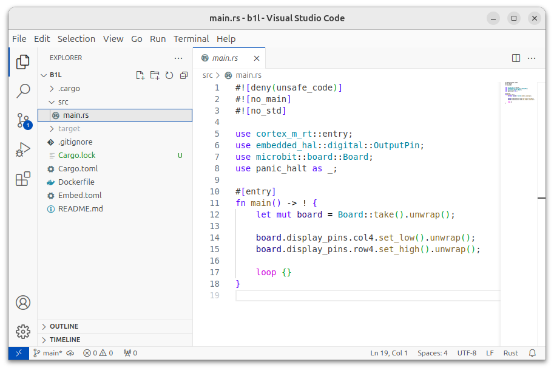
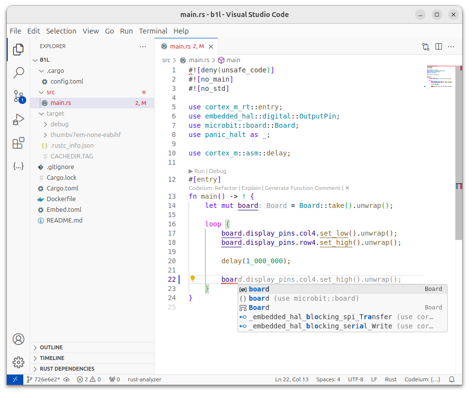

# 第2章 让第一个LED灯闪烁与编程神器

孔子在2500多年前说过："工欲善其事，必先利其器。"他老人家虽然只说出了结果，却没有说明原因。其实原因很简单，就像第1章中小小白从typst的"路人"转为"粉丝"的原因一样——**顺手的工具能给你超好的用户体验**。本章我们将通过实现嵌入式开发圈子里的"Hello, world!"，来感受各种编程神器是否能带给你出色的用户体验。

那么，什么是嵌入式开发圈子里的"Hello, world!"呢？在这个圈子里，仅仅点亮一个LED还不够格，只有让LED持续闪烁（blink），才算真正完成了"Hello, world!"，如图2-1所示：


图2-1 在嵌入式开发圈子里，"Hello, world!"就是让一个LED灯持续闪烁

# 2.1 查看AI写的闪烁代码改了什么

该如何修改上一章的点亮第一个LED的代码，使其闪烁呢？闪烁和点亮（常亮）的区别在于需要添加熄灭和延时的功能。我们可以像上一章那样，先运行下面的命令，从模板生成点亮LED的代码，然后在此基础上修改：

```bash
cargo generate wubin28/mb2-led-template
# 当工具提示输入Project Name时，可以输入b1l，表示Blink 1st Led
# 进入这个新创建的项目目录
cd b1l
```

但对于第一次编写熄灭和延时的代码，不会写该怎么办呢？

⚠️遇到从未编写过的代码时，程序员该如何处理？传统做法是上网搜索，然后复制粘贴并修改。现在有了AI助手，事情变得简单多了。只需这样问AI："请阅读代码清单1-6，将其改造成让LED持续闪烁的代码，要求改动简单易懂，适合编程小白理解。"AI很快就会给出一份代码。

## 2.1.1 用Git管理代码版本

⚠️接下来的问题是：如何便捷地对比AI给出的代码，查看具体改动了哪些地方？最简单的方式是创建两个独立文件并使用文件对比工具，但这并不专业。对于版本管理这类需求，更好的解决方案是使用git这样的专业工具。再配合流行的编辑器VS Code，就能轻松查看代码的版本差异。

🔎Git是一个神奇的版本控制工具，就像时光机一样，帮助程序员记录和追踪代码的每一次变化。无论是独自开发还是团队协作，Git都能让你得心应手。

Git就像一个巨大的树屋，其中代码的版本树不断生长，每个新的变更都基于前一次提交延伸。每位开发者都拥有完整的代码副本，并且所有历史记录都保存在本地，因此无需持续联网工作。由于大多数操作都在本地完成，Git的运行速度也特别快。

Git最强大的特性是分支功能。你可以轻松创建实验分支，尝试各种想法，不满意时随时可以回到原始版本。每次提交代码时，Git都会详细记录修改者、时间和具体改动，就像一本完整的开发日志。借助GitHub等平台，团队成员可以便捷地共享和协作。

Git带来诸多好处：多人可以并行开发而不互相干扰，随时可以回退版本，支持离线工作。每次提交都有唯一标识，确保代码安全。此外，Git能在Windows、Mac和Linux上完美运行。

当然，Git也有一些挑战。新手可能需要时间记忆各种命令，操作不当可能会丢失代码。处理多人同时修改同一代码时需要一定经验，有时还需要掌握配套工具才能充分发挥Git的优势。

不过，Git确实适用于各类开发场景。从团队项目到个人开发，从开源项目到编程学习，Git都能发挥重要作用。虽然起步可能有些困难，但掌握基础命令后，你会发现它是个强大的助手。建议从基础开始，循序渐进地体会它的优势。

✅要保存点亮LED灯的代码的版本以便和AI生成的LED灯闪烁代码对比，请按表2-1所示要点安装Git：

表2-1 Git安装要点

| **在Ubuntu 24上安装Git** | **在macOS上安装Git** | **在Windows 11上安装Git** |
| --- | --- | --- |
| # 查看git版本（检查是否已安装）<br>`git --version`<br>`apt list --installed \| grep git`<br># 推荐使用apt安装git<br>`sudo apt install git`<br># 参考网页<br>https://git-scm.com/downloads/linux<br># 检查最新可安装版本<br>`apt show git \| grep Version`<br># 升级<br>`sudo apt update`<br>`sudo apt upgrade git`  | # 查看包管理器brew版本号<br>`brew --version`<br># 若未安装brew则安装<br>`/bin/bash -c "$(curl -fsSL https://raw.githubusercontent.com/Homebrew/install/HEAD/install.sh)"`<br># 查看git版本（检查是否已安装）<br>`git --version`<br>`brew info git`<br># 推荐使用apt安装git<br>`brew install git`<br># 参考网页<br>https://git-scm.com/downloads/mac<br># 升级<br>`brew update`<br>`brew upgrade git` | # 查看git版本（检查是否已安装）<br>`git --version`<br>`winget list git`<br># 推荐使用winget安装git<br>`winget install --id Git.Git -e --source winget`<br># 参考网页<br>https://git-scm.com/downloads/win<br># 升级<br>`winget upgrade --id Git.Git` |

安装Git后，进入b1l目录并运行以下命令来查看代码库状态（注意：`%`是zsh的命令行提示符，它用来区分命令和输出结果，输入命令时不需要输入）：

```bash
# 显示当前 Git 仓库的状态信息
% git status
On branch main # 当前处于 main 分支，我们主要就在它上面编程

No commits yet # 当前仓库尚未进行任何提交，意味着没有任何历史记录

Untracked files: # 列出了所有尚未被 Git 跟踪的文件和目录。
                 # 这些文件需要被明确添加到 Git 的跟踪列表中才能纳入版本控制
  # 下面一行提示如何将未被跟踪的文件添加到暂存区，准备进行提交
  (use "git add <file>..." to include in what will be committed)
	.cargo/
	.gitignore
	Cargo.toml
	Dockerfile
	Embed.toml
	README.md
	src/

# 下面一行提示当前尚未将任何文件添加到暂存区（staging area），但存在未被跟踪的文件。
# 可以通过运行 git add <file> 来开始跟踪这些文件
nothing added to commit but untracked files present (use "git add" to track)
```

别担心看不懂上面的解释。关键是要明白`cargo generate`已经帮我们完成了Git仓库的初始化，并生成了相关文件。这些文件目前还未被纳入版本控制系统。要开始追踪它们，我们需要两步：先用`git add`命令将文件添加到暂存区（staging area），再用`git commit`命令提交它们。暂存区是Git在工作目录（Working Directory）**和**版本库（Repository）之间设置的中间区域，用来组织和管理即将提交的代码变更。

先看用`git add .`命令（注意后面的小数点不要忘记，它表示所有文件）将文件添加到暂存区，如下所示：

```bash
# 将当前工作目录中所有已修改或新建的文件添加到 Git 的暂存区
% git add .
% git status
On branch main

No commits yet

Changes to be committed: # 显示已经添加到暂存区的更改，这些更改将包含在下一次提交中
  # 下面一行提示可以使用 git rm --cached <file> 将文件从暂存区移除
  # （即撤销 git add 操作）
  (use "git rm --cached <file>..." to unstage)
	new file:   .cargo/config.toml # 列出了所有被添加到暂存区的新文件，
	                               # 表示它们将在下一次提交中被包含
	new file:   .gitignore
	new file:   Cargo.toml
	new file:   Dockerfile
	new file:   Embed.toml
	new file:   README.md
	new file:   src/main.rs
```

运行 `git add .` 后，所有文件（包括新文件和修改的文件）已被添加到暂存区。这些文件已准备好进行提交，可以使用 `git commit -m "<message>"` 命令完成首次提交。提交时需要添加提交信息，它能帮助我们日后查看这次提交修改了什么。这样就能将这些更改永久保存到 Git 的版本历史中：

```bash
# 将暂存区中的内容提交到版本库，记录到历史中
# -m：指定提交信息为 "chore: initialized the project"
# chore 是一种常见的提交类型，用于表示非功能性更改（如初始化项目、更新配置等）
# 提交注释也可以写中文，但练习用英文写能方便与国外程序员的沟通，
# 另外在AI翻译的帮助下写英文注释也不是难事
% git commit -m "chore: initialized the project" 
# [main]：表示提交是在 main 分支上进行的
# (root-commit)：表示这是该仓库的第一次提交（即根提交）
# b7d4d95：提交的唯一哈希值，便于跟踪该提交
[main (root-commit) b7d4d95] chore: initialized the project
 # 7 files changed：共有 7 个文件被更改或新增
 # 326 insertions(+)：总共新增了 326 行内容
 7 files changed, 326 insertions(+)
 # create mode 100644：表示新增了这些文件
 # 100644 是文件的权限标志，表示普通文件，且拥有者具有读写权限，
 # 组和其他用户只有读权限
 create mode 100644 .cargo/config.toml
 create mode 100644 .gitignore
 create mode 100644 Cargo.toml
 create mode 100644 Dockerfile
 create mode 100644 Embed.toml
 create mode 100644 README.md
 create mode 100644 src/main.rs
```

**一目了然的Git提交信息前缀**

🔎专业程序员在写git提交信息时，为何愿意用“chore: “这样的开头？

专业程序员在编写 Git 提交信息时，通常使用"chore:"等前缀来标记代码库的维护性更改。这些更改虽然不直接影响应用功能，但对项目的健康和可维护性非常重要。这种前缀规范让团队成员能快速理解每次提交的目的。

常见的 Git 提交信息前缀包括：

- **feat**：添加新功能
- **fix**：修复错误
- **docs**：修改文档
- **style**：调整代码格式（不改变逻辑）
- **refactor**：重构代码（不新增功能或修复错误）
- **test**：添加或修改测试
- **chore**：更新构建过程或辅助工具

采用这种提交信息规范能提高代码库的可读性，让团队协作更加顺畅。

此时如果再次运行 git status 命令查看代码库状态，会看到以下变化：

```bash
% git status
On branch main
# nothing to commit：暂存区中没有任何更改需要提交
# 说明工作目录中的所有修改已被提交，或者暂存区和工作目录都没有未跟踪的更改                                    
# working tree clean：
# 工作目录是干净的，没有未被跟踪或未提交的文件
# 文件状态没有变化（没有新建、修改或删除的文件）
nothing to commit, working tree clean
```

而我们刚才那次提交，可以从下面的命令中看到：

```bash
% git log --oneline
# 打开一个字符界面，显示了上一次提交的哈希值和提交信息
b7d4d95 (HEAD -> main) chore: initialized the project
(END)
# 按q键退出
```

这表明先前点亮LED的代码已被保存在Git版本库的b7d4d95提交中。当我们根据AI提供的代码进行修改后，就可以在VS Code中轻松查看两个版本之间的差异。

## 2.1.2 用VS Code查看原先点亮LED灯的代码

VS Code是微软开发的一款主流代码编辑器。它不仅免费开源，还支持Windows、macOS和Linux等多种系统。作为开发工具，它提供了强大的编辑和调试功能。

VS Code的特点鲜明：它轻便快速，资源占用少；跨平台特性让开发者能在不同系统上保持相同的开发环境；丰富的插件市场几乎能满足所有功能需求。

VS Code内置了众多实用功能，包括智能代码补全、语法高亮、Git版本控制、调试器和终端。通过JSON配置文件和插件，开发者可以根据需求定制编辑器。

VS Code最大的优势在于：既保持轻量，又功能强大。开源特性和活跃社区为它提供持续发展动力。通过插件，它可以支持任何编程语言。虽然不及专业IDE那样全能，但基础的开发环境功能一应俱全。微软的持续更新也让它始终保持技术领先。

当然，VS Code也存在一些局限：许多高级功能需要额外安装插件，可能增加配置复杂度；过多插件会影响性能；新手需要时间适应；在大型项目上的功能可能不及JetBrains等专业IDE。

VS Code最适合哪些场景？它特别擅长小型到中型项目开发，如个人项目或开源项目。在Web开发方面，它对HTML、CSS、JavaScript等前端技术支持出色。多语言支持让它适合全栈开发。对需要跨平台工作的开发者来说，它是理想选择。值得一提的是，它在嵌入式开发领域表现优异，比如通过Rust的embedded插件就能进行嵌入式开发。免费开源和功能丰富的特点也使它成为教学的好工具。

VS Code凭借轻量级、强大的扩展性和完善的功能赢得了开发者的欢迎，尤其适合需要灵活开发环境的程序员。但对于需要特定语言深度支持或大型项目管理的场景，可能还需要配合专业IDE使用。

✅若要编辑和对比AI生成的LED闪烁代码与之前的LED点亮代码，请按表2-2所示要点安装VS Code：

表2-2 VS Code安装要点

| **在Ubuntu 24上安装VS Code** | **在macOS上安装VS Code** | **在Windows 11上安装VS Code** |
| --- | --- | --- |
| # 检查是否已安装VS Code：按窗口键→搜“code”<br># 先下载然后使用apt安装后缀为.deb的VS Code安装包<br># 参考网页<br>https://code.visualstudio.com/download<br>`sudo apt install code_xxx_amd64.deb`<br># 验证安装是否成功<br>`code ./`<br># 查看VS Code版本<br>`code --version`<br># 检查最新可安装版本<br>`apt show code \| grep Version`<br># 升级<br>`sudo apt update`<br>`sudo apt upgrade code` | # 检查是否已安装VS Code：按spotlight快捷键→搜“code”<br># 先下载然后解压最后把解压后的VS Code的.app文件拖入Applications文件夹<br># 参考网页<br>https://code.visualstudio.com/download<br># 验证安装是否成功<br>`code ./`<br># 查看VS Code版本<br>`code --version`<br># 升级：在Code界面左上角点击Code，然后选择Check for Updates… | # 检查是否已安装VS Code：按窗口键→搜“code”<br># 先下载然后鼠标双击后缀为.exe的安装包<br># 参考网页<br>https://code.visualstudio.com/download<br># 验证安装是否成功<br>`code ./`<br># 查看VS Code版本<br>`code --version`<br># 升级：左上角三条横线图标→Help→Check for updates… |

安装完成VS Code后，我们可以在b1l目录中输入以下命令，用VS Code打开之前点亮LED灯的代码：

```bash
# 在Ubuntu的terminal里输入下面命令
# code ./: 打开当前目录（./）中的内容，使用 Visual Studio Code 编辑器
# > /dev/null: 将命令的标准输出（stdout）重定向到/dev/null，
#              相当于丢弃了输出，避免输出显示在终端
# 1>&2：将标准输出（1）重定向到标准错误输出（2）
#       由于之前已经将标准输出定向到 /dev/null，此时标准输出实际上也是被丢弃
# &: 将命令放到后台运行，这样终端不会被阻塞，可以继续输入其他命令
% code ./ > /dev/null 1>&2 &

# 在macOS的terminal里输入下面命令
% code ./

# 在Windows 11的cmd里输入下面命令
> code .\
```

之后在VS Code左侧项目文件树中选择src/main.rs文件进行查看，如图2-2所示：



图2-2 在VS Code左侧项目文件树中选择src/main.rs文件

## 2.1.3 查看AI给出的代码的变动

我们之前让AI根据点亮LED灯的代码给出了闪烁LED的代码。现在让我们把AI生成的代码复制过来，替换main.rs中的原有代码，如图2-3所示：


图2-3 复制AI生成的代码并替换main.rs中的原有代码

**用git diff仅查看代码变动**

✅相比图2-2中的代码，图2-3中有哪些变化呢？虽然VS Code已经在代码行号右侧用竖线标记出了变动部分，但运行下面的命令对比会更加直观：

```bash
# 显示当前工作区中未暂存（尚未执行`git add`）的更改内容
% git diff
diff --git a/src/main.rs b/src/main.rs
index c5d9f4c..5379e3f 100644
# 分别表示变更前(-)和变更后(+)的文件名
--- a/src/main.rs
+++ b/src/main.rs
# 表示变更的位置:从第7行开始,变更前有12行,变更后有20行
@@ -7,12 +7,20 @@ use embedded_hal::digital::OutputPin;
 use microbit::board::Board;
 use panic_halt as _;
 
# 以加号(+)开头的行表示新增的一行
+use cortex_m::asm::delay;
+
 #[entry]
 fn main() -> ! {
     let mut board = Board::take().unwrap();
# 以减号(-)开头的行表示移除的一行
-
-    board.display_pins.col4.set_low().unwrap();
-    board.display_pins.row4.set_high().unwrap();
-
-    loop {}
+    
+    loop {
+        board.display_pins.col4.set_low().unwrap();
+        board.display_pins.row4.set_high().unwrap();
+        
+        delay(1_000_000);
+        
+        board.display_pins.row4.set_low().unwrap();
+        
+        delay(1_000_000);
+    }
 }
(END)
```

`git diff`适合查看代码变动行及其简短的上下文（变动处前后未变动的几行），但无法同时展示变动和完整的代码文件。比如，上述`git diff`命令就没有显示main.rs的完整内容。那么，如何既能看到变动又能查看完整代码呢？

**用VS Code查看完整代码中的变动**

✅这里有个两全其美的方法：在VS Code中点击图2-3左侧带有数字2标记的分支图标（表示有2个文件发生变动），打开代码变更树，然后点击main.rs文件。这样右侧窗口就会清晰展示AI给出的代码与上次提交版本之间的差异，以及完整的源文件内容，如图2-4所示：


图2-4 在VS Code中查看AI给出的代码与上次提交的代码之间的差异

✅现在，请参照图2-4右侧显示的AI生成的代码来修改你的main.rs源代码。完成修改后，我们将一起详细解读这段代码。

**用rust-analyzer插件自动显示变量类型**

🔎当你在输入代码时，是否好奇`let mut board = Board::take().unwrap();`这行代码中，变量`board`经过自动推断后的具体类型是什么？虽然图2-3中没有直接显示，但有一个神器可以帮你看到——VS Code的rust-analyzer插件，如图2-5所示：


图2-5 安装了rust-analyzer插件后能在代码中看到变量board的类型，将鼠标放到上面还能显示文档

作为VS Code的扩展插件，rust-analyzer是Rust官方推荐的代码编辑辅助工具，为开发者提供智能的代码分析和辅助功能。

它具备多项实用特性：实时代码补全建议、语法高亮显示、快捷跳转到定义、实时错误提示与改进建议、代码重构功能（如重命名和提取函数）、宏展开显示，以及内置文档查看。最重要的是，它运行高效且资源占用少。

作为Rust官方推荐工具，rust-analyzer与Rust生态系统完美配合。它提供近似专业IDE的开发体验，且因采用Rust编写而保持高效运行。对初学者来说，只要安装了Rust工具链，配置过程简单直观。此外，它拥有活跃的开发者社区，能快速响应用户问题。

当然，它也存在一些局限。与全功能IDE相比，其项目导航和调试功能仍需加强。处理复杂宏时可能不够完善，大型项目中可能出现响应延迟。另外，它需要正确配置Rust工具链才能发挥全部功能。

尽管如此，rust-analyzer仍是大多数开发者的理想选择。它能满足个人开发和团队协作的需求，对Rust新手尤其友好，其代码补全和诊断功能显著提升学习效率。在中小型项目开发中，它帮助开发者快速编写和调试代码。搭配VS Code使用时，它提供轻量而强大的开发环境。

无论是VS Code下的Rust开发，还是Rust入门学习，rust-analyzer都是不可多得的开发工具。它不仅提升开发效率，更有助于提高代码质量。

✅要安装rust-analyzer插件，只需点击VS Code界面左侧工具栏中带有四个小方块的Extensions图标，打开Extensions Marketplace界面，然后在搜索栏中输入rust-analyzer并安装即可。

**用VS Code的Codeium插件获得AI自动代码补全建议**

🔎随着AI助手与程序员结对编程变得越来越普及，你是否也希望在编写代码时获得实时的智能提示？只需输入一行命令开头的几个字符，就能收到AI的代码补全建议。如果你对这个功能感兴趣，可以安装VS Code的免费插件Codeium，如图2-6所示：



图2-6 安装了VS Code的Codeium插件后，只要输入一行代码开头几个字符`boar`，就能收到AI的代码补全建议

Codeium是一款强大的AI编程助手插件，为开发者提供革命性的编程体验。它支持包括Rust、Python、JavaScript在内的多种编程语言，通过智能代码补全和自然语言提示功能显著提升开发效率。

在实际应用中，Codeium的特色功能令人印象深刻。它的AI代码补全系统能够理解上下文并根据开发者意图生成完整的函数和逻辑。其多语言支持简化了跨语言开发，而自然语言转代码的功能让编程变得更加直观。它还能生成常用代码片段，并通过学习适应用户的编程风格。

Codeium为开发者带来显著优势。它提升了编程效率，尤其适合快速原型开发。对初学者而言，它就像一位耐心的导师，通过智能提示帮助掌握语法和最佳实践。它的多语言支持在跨语言项目中尤为重要。更关键的是，它降低了编程门槛——开发者只需用自然语言描述即可生成基础代码。作为免费工具，其核心功能对所有个人开发者开放。

但Codeium也有其局限性。它在处理复杂的Rust代码时可能难以准确理解上下文。作为AI驱动的工具，它需要较多计算资源且依赖网络连接。生成的代码可能需要优化，同时在代码处理过程中也需注意隐私安全问题。

即便如此，Codeium在多个场景中表现优异。它不仅适合快速原型开发，还能帮助初学者理解编程概念。在跨语言项目中，其多语言支持价值突出。通过简化开发流程和减少重复性工作，它有效提升了开发效率。

Codeium是一款价值突出的AI编程助手，特别适合Rust开发者、跨语言开发者和编程新手。虽然在复杂项目或高隐私要求场景下需谨慎使用，但它在日常开发和学习中的表现令人称道。

✅要安装Codeium插件，只需点击VS Code界面左侧工具栏中Extensions图标，打开Extensions Marketplace界面，然后在搜索栏中输入codeium并安装即可。

# 2.2 编译、运行与提交

✅在详细解读AI生成的代码前，让我们先在b1l目录下运行以下命令来编译并测试代码是否能正常工作：

```bash
% cargo run
   Compiling semver-parser v0.7.0
   （其他行略）
   Compiling b1l v0.1.0 (/home/bens/temp/b1l)
    Finished `dev` profile [unoptimized + debuginfo] target(s) in 19.28s
     Running `probe-rs run --chip nRF52833_xxAA target/thumbv7em-none-eabihf/debug/b1l`
 WARN probe_rs::util::rtt: No RTT header info was present in the ELF file. Does your firmware run RTT?
      Erasing ✔ [00:00:00] [############################] 20.00 KiB/20.00 KiB @ 35.44 KiB/s (eta 0s )
  Programming ✔ [00:00:01] [############################] 20.00 KiB/20.00 KiB @ 19.39 KiB/s (eta 0s )    Finished in 1.626s

```

由于在上一章中已经安装了目标平台和probe-rs烧录工具，所以这次可以直接顺利运行cargo run命令（该命令包含了cargo build的功能）。开发板第4行第4列的LED在短暂熄灭后（这是因为probe-rs在烧录程序前需要先擦除开发板上的原有程序），便开始快速闪烁起来，如图2-7所示：


图2-7 AI给出的闪烁代码果然让开发板的第4行第4列的LED快速地闪烁起来

✅既然代码可以正常运行，我们就可以运行以下以`%`开头的几个命令来提交代码，这样将来修改时就能方便地进行对比：

```bash
# 按Ctrl+C中止程序，让终端回到命令行提示状态
% git status
On branch main
Changes not staged for commit:
  (use "git add <file>..." to update what will be committed)
  (use "git restore <file>..." to discard changes in working directory)
	modified:   src/main.rs # main.rs文件包含AI的闪烁代码

Untracked files:
  (use "git add <file>..." to include in what will be committed)
	Cargo.lock # 因为这是应用程序，所以自动生成的Cargo.lock需要提交，以便保持依赖的稳定性

no changes added to commit (use "git add" and/or "git commit -a")
% git add .
% git status
On branch main
Changes to be committed:
  (use "git restore --staged <file>..." to unstage)
	new file:   Cargo.lock
	modified:   src/main.rs
# 按照社区约定的Rust标准风格格式化源码，包括代码缩进、空格、换行等，
# 确保项目中的代码风格统一，避免不同开发者之间因格式差异引起的冲突，
% cargo fmt
% git commit -m "feat: blinked the LED using cortex_m::asm::delay"
[main 726e6e2] feat: blinked the LED using cortex_m::asm::delay
 2 files changed, 438 insertions(+), 5 deletions(-)
 create mode 100644 Cargo.lock
% git log --oneline
726e6e2 (HEAD -> main) feat: blinked the LED using cortex_m::asm::delay
b7d4d95 chore: initialized the project

```

# 2.3 解读AI给出的闪烁代码

让我们通过代码注释重点解读AI给出的闪烁代码中新增的部分，具体内容如代码清单2-1所示：

代码清单2-1 ch02/b1l/src/main.rs 使用让处理器空转的cortex_m::asm::delay()函数实现延时

```rust
#![deny(unsafe_code)]
#![no_main]
#![no_std]

use cortex_m_rt::entry;
use embedded_hal::digital::OutputPin;
use microbit::board::Board;
use panic_halt as _;

// 导入延时函数，用于实现程序中的时间延迟
use cortex_m::asm::delay;

#[entry]
fn main() -> ! {
    let mut board = Board::take().unwrap();
    
    loop {
        board.display_pins.col4.set_low().unwrap();
        board.display_pins.row4.set_high().unwrap();
        
        // delay()是使用处理器内部循环来实现延时的函数，
        // 参数值代表处理器要执行的循环次数，相当于约1/16秒
        delay(1_000_000);
        
        // 将第4行设置为低电平，以便熄灭这个LED
        board.display_pins.row4.set_low().unwrap();
        
        // 再次延时约1/16秒
        delay(1_000_000);
    }
}
```

🔎延时功能 `delay(1_000_000)` 是如何工作的？这个功能就像给程序设置一个短暂的休息时间。当程序执行到这里时，处理器会进入空转状态——就像在原地踏步，白白消耗电量。

我们的开发板使用的处理器运算速度很快，每秒可执行6400万次基本运算。当处理器空转100万次时，由于每次空转需要4次基本运算，总共就需要400万次基本运算。根据处理器的运算速度，这段休息时间约为0.0625秒（即1/16秒）。

在LED闪烁程序中，LED的亮和灭状态各需要一次休息，因此一个完整的闪烁周期约为1/8秒（难怪LED闪烁得很快）。如果想调整LED闪烁的速度，只需修改这个数值：暂停1秒用16,000,000，暂停0.5秒用8,000,000，要实现更快的0.1秒闪烁则使用1,600,000。

# 2.4 改进AI给出的闪烁代码

⚠️不过，代码清单2-1中使用 `cortex_m::asm::delay()` 的延时方式存在两个主要局限性：首先，让处理器执行空指令循环来"数数"会使处理器持续运行并消耗电能；其次，这种计时方式的精确度较低。要实现更精确的计时，我们应该使用开发板上的专用硬件定时器功能。那么，如何使用这些专用硬件定时器呢？

遇事不决，求助AI。让我们把这个疑问和代码清单2-1交给AI，请它给出改进后的代码，如代码清单2-2所示：

代码清单2-2 ch02/b1l/examples/b1lut0.rs 使用mb2开发板上的专用硬件定时器TIMER0外设实现延时

```rust
#![deny(unsafe_code)]
#![no_main]
#![no_std]

use cortex_m_rt::entry;
use embedded_hal::digital::OutputPin;
// 导入延时功能的DelayNs trait
use embedded_hal::delay::DelayNs;
use microbit::board::Board;
// 导入开发板专用硬件定时器功能
use microbit::hal::timer::Timer;
use panic_halt as _;

#[entry]
fn main() -> ! {
    let mut board = Board::take().unwrap();

    // 初始化硬件定时器TIMER0
    let mut timer = Timer::new(board.TIMER0);

    loop {
        board.display_pins.col4.set_low().unwrap();
        board.display_pins.row4.set_high().unwrap();

        // 延时500毫秒
        timer.delay_ms(500_u32);

        board.display_pins.row4.set_low().unwrap();

        // 再次延时500毫秒
        timer.delay_ms(500_u32);
    }
}
```

🔎如果你不想手动输入代码清单2-2的内容，可以直接运行本书代码库中已经写好的代码。只需在终端的ch01/b1l文件夹下运行下面的命令：

```bash
# b1lut0表示Blink the 1st Led Using Timer0
cargo run --example b1lut0
```

🔎硬件定时器的工作原理其实很简单：当需要计时时，我们先给定时器设定一个目标值，然后启动它开始计数。有趣的是，在定时器计数期间，处理器可以进入睡眠模式来节省电能，而不必保持工作状态。当定时器达到目标值时，它会自动发出中断信号，将处理器从睡眠中唤醒。

这种设计带来了三大优势：由于处理器可以在计时过程中进入低功耗模式，显著降低了能源消耗；使用专门的硬件计数器，让计时精确度远超软件计时；最关键的是，处理器不会被计时任务占用，可以专注于处理其他工作，特别适合需要同时处理多项任务的场景。

✅修改完代码后，运行以下命令来格式化、编译、运行并提交代码（后续类似步骤将不再重复说明）。

```bash
% cargo fmt
% cargo clean
% cargo run
# 按Ctrl+C退出循环程序
% git status
% git diff
# 按q键退出git diff界面
% git add .
% git status
% git commit -m "feat: blinked the LED using microbit::hal::timer::Timer"
% git log --oneline
# 按q键退出git log界面
```

⚠️在终端里逐个输入这些命令是不是很费时？即便使用键盘上的上下箭头键、在终端中输入`history`命令（适用于Ubuntu/macOS及Windows 11的PowerShell 7+），或按`Ctrl+R`来搜索历史命令，操作起来还是不够便捷。有没有更好用的终端命令行神器，能让我们更轻松地输入命令呢？

# 2.5 在终端轻松输入命令的神器

🔎想让命令行操作更轻松吗？神器可以帮你简化git命令——输入`gst`代替`git status`查看状态，用`ga .`替代`git add .`添加文件到暂存区。它还能实时显示git仓库状态，并提供智能的命令补全功能。

神器还会基于你的使用历史提供命令建议。当你开始输入一行命令的头几个字符时，它会用淡灰色显示可能的完整命令（即你以前输入过的命令）。只需按下右方向键或`Ctrl+E`，就能快速采用建议，大幅提升输入效率。

更棒的是，它能用颜色标记命令状态：正确的命令显示为绿色，错误的显示为红色。文件路径也有独特的颜色标记，让你一眼就能判断命令是否正确。

除此之外，它还提供了强大的命令补全功能，支持更多命令和参数的智能补全，让你的命令行操作更加流畅自然。如图2-8和2-9所示：


图2-8 Ubuntu和macOS上的Oh My Zsh会用红叉标记错误命令`gti`，并在用户输入`git c`后自动以灰色字体显示历史命令建议


图2-9 Windows 11上的Oh My Posh会用红叉标记错误命令`gti`，并在用户输入`git c`后自动以灰色字体显示历史命令建议

看起来很心动对吧？这个神器就是Oh My Zsh（适用于Linux和macOS）和Oh My Posh（适用于Windows）及其插件。

## 2.5.1 提升终端使用体验的Oh My Zsh和Oh My Posh

🔎如果你是Linux或macOS用户，Oh My Zsh将是你的得力助手。这个开源的Zsh配置框架不仅能简化命令行操作，还能显著提升工作效率。通过丰富的插件系统和主题配置，你的终端将变得既实用又美观。

Oh My Zsh最吸引人的地方在于它的实用性。它提供了大量现成的插件，如git和docker插件，为你带来智能命令补全和便捷的别名功能。想要个性化？它有150多种主题供选择，让你的终端界面焕然一新。对新手来说，它的自动化配置和更新机制非常友好。更重要的是，它拥有活跃的社区，不断开发新的功能和插件。

使用Oh My Zsh后，你会发现日常操作变得轻松自如。它的插件生态系统覆盖了从开发到版本控制的各种场景，你可以根据需求灵活调整功能。当然，它也有局限性：安装过多插件可能会降低终端启动速度，而且需要一些时间来熟悉各项配置。

如果你是Windows用户，Oh My Posh是你的理想选择。这款专为Windows平台打造的终端美化工具支持PowerShell、Windows Terminal等多种终端模拟器，主要特色是美化终端外观并提供状态显示功能。

Oh My Posh提供丰富的主题选择，让你随心切换不同风格。它与Windows上的各种终端模拟器和shell完美兼容，还能实时显示Git仓库状态和分支信息。作为轻量级工具，它专注于核心功能，不会增加系统负担。

Oh My Posh的优势显而易见：它能让终端界面更加美观清晰，配置简单直观，且系统资源占用少。然而，它也有局限性：功能主要集中在外观优化上，对命令行操作的改进有限，插件数量也不如Oh My Zsh丰富。不过，对于想要美化终端界面并简化Git操作的Windows用户来说，Oh My Posh仍是理想之选。

🧠 Linux和macOS上的Oh My Zsh和Windows上的Oh My Posh配置框架分别为Git 操作提供了哪些快捷命令？

## **2.5.2 基础平台zsh或PowerShell 7+**

这些神器虽然强大，但在使用前需要先安装它们的基础平台——Linux和macOS用户需要安装zsh，Windows用户则需要安装PowerShell 7+（表示版本7或更高版本）。可以按照表2-3的安装要点安装zsh或PowerShell 7+：

表2-3 zsh或PowerShell 7+安装要点

| **在Ubuntu 24上安装zsh** | **在macOS上安装zsh** | **在Windows 11上安装PowerShell 7+** |
| --- | --- | --- |
| # 查看zsh版本（检查是否已安装）<br>`zsh --version`<br>`apt list --installed \| grep zsh`<br># 推荐使用apt安装zsh<br>`apt install zsh`<br># 参考网页<br>https://github.com/ohmyzsh/ohmyzsh/wiki/Installing-ZSH<br># 将zsh设置为默认shell后重新登录<br>`chsh -s $(which zsh)`<br># 验证安装是否成功<br>`echo $SHELL`<br># 检查最新可安装版本<br>`apt show zsh \| grep Version`<br># 升级<br>`sudo apt update`<br>`sudo apt upgrade zsh` | # 查看zsh版本（检查是否已安装）<br>`zsh --version`<br>`brew info zsh`<br># 推荐使用brew安装zsh<br>`brew install zsh`<br># 参考网页<br>https://github.com/ohmyzsh/ohmyzsh/wiki/Installing-ZSH<br># 验证安装是否成功<br>`echo $SHELL`<br># 升级<br>`brew update`<br>`brew upgrade zsh` | # 安装PowerShell 7+以替代系统自带的5.1<br># 查看PowerShell版本（检查是否已安装）<br>`winget list Microsoft.PowerShell`<br># 推荐使用winget安装git<br>`winget install --id Microsoft.Powershell --source winget`<br># 参考网页<br>https://learn.microsoft.com/en-us/powershell/scripting/install/installing-powershell-on-windows?view=powershell-7.4<br># 升级<br>`winget upgrade --id Microsoft.Powershell` |

🔎Zsh（Z Shell）是一款功能强大的工具。作为Unix shell和命令行解释器，它不仅保留了Bash的所有优点，还增添了许多新特性。无论在macOS还是Linux系统上，它都能提供友好且高度可定制的命令行环境。

Zsh最突出的特点是其智能功能。它提供命令、文件名和路径的自动补全，让编程更加流畅。对于脚本编写者来说，它不仅完全兼容Bash语法，还提供了更多灵活选项。通过Oh My Zsh框架，你可以轻松安装主题和插件，打造既实用又美观的终端。

在日常使用中，Zsh的贴心设计随处可见。它的提示符能显示Git状态和系统状态等实用信息。它的历史记录搜索功能直观高效，让你轻松找到之前使用过的命令。更重要的是，它在macOS和Linux上提供一致的使用体验，并且具有强大的文件匹配能力，能轻松应对复杂的目录结构。

Zsh的优势明显：内置实用功能如共享历史和行内历史补全；通过Oh My Zsh或Prezto支持丰富的插件生态；智能补全和快捷键提升工作效率；活跃的社区支持；高度可定制性；原生Git支持让版本控制更简单。

当然，Zsh也存在一些局限性。新手可能需要时间适应其丰富的功能。安装过多插件会影响启动速度。某些脚本可能需要调整才能与Bash完全兼容。部分功能依赖插件可能带来额外问题。某些Linux发行版需要手动安装和配置。

谁最适合使用Zsh？软件开发者和运维人员可以通过它提升工作效率；喜欢个性化的用户会享受其丰富的主题和插件；跨系统工作的用户会感激其一致性体验；复杂Shell脚本的编写者能从中受益；Git用户会欣赏其原生支持。

Zsh就像一位得力助手。虽然初期需要一定学习时间，但掌握后必定让你的命令行工作事半功倍。无论是效率提升还是使用体验，它都不会让你失望。

🔎让我们来了解PowerShell的两个重要版本：PowerShell 5.1和PowerShell 7+。PowerShell 5.1是Windows 11自带的版本，它就像一个专为Windows量身定制的管家，基于.NET Framework开发。PowerShell 7+则是一位现代化的多面手，它基于.NET Core（现在是.NET 5+）构建，可在Windows、Linux和macOS上运行。

PowerShell 5.1就像一位经验丰富的Windows专家，对系统了如指掌。它拥有丰富的模块库，擅长管理Windows的系统API、服务、注册表和文件系统。不过，它只在Windows平台工作，就像一位"专一"的管家。

PowerShell 7+则像一位见多识广的现代管家。它不仅跨平台工作，还带来了管道链运算符和并行处理等新功能。它的错误处理更智能，性能更出色。虽然它能运行大多数PowerShell 5.1的模块，但在某些场景可能遇到兼容性问题。

这两位管家各有优势：PowerShell 5.1作为Windows家族的老管家，拥有丰富的社区资源且开箱即用。PowerShell 7+则像位精通多国语言的现代管家，适应性强，性能更好，功能持续更新。

当然，每位管家都有局限。PowerShell 5.1局限于Windows平台，功能更新已停滞。PowerShell 7+虽然现代化，但需要额外安装，可能有兼容性问题，新用户需要时间适应新特性。

如何选择？如果你主要在Windows环境工作，特别是需要使用大量传统Windows工具和脚本，选择PowerShell 5.1更合适。如果你需要跨平台工作，或想要更现代化的开发体验（尤其是在DevOps和云计算领域），PowerShell 7+是更好的选择。对于新项目，我们推荐使用PowerShell 7+，因为它代表着PowerShell的未来。

## **2.5.3 具备分屏功能和美观界面的现代化终端**

✅完成zsh或PowerShell 7+的安装后（Windows用户请注意：后续所有终端命令都需要在PowerShell 7+中运行），如果想要更优质的使用体验，尤其是在分屏功能和界面美观度方面，那么可以安装一款现代化的终端。

具体推荐如下（旧终端 → 新终端）：

- Ubuntu：GNOME Terminal → Terminator
- macOS：Terminal → iTerm2
- Windows 11：CMD → Windows Termina

这三个旧终端都不支持分屏功能，而新终端都支持。后续所有终端命令都将在这些现代化终端（安装要点见后文）中执行。

以Ubuntu的Terminator为例，在用gdb调试mb2开发板时，按下`Ctrl+Shift+E`可将屏幕分为左右两部分：左侧运行`cargo embed`连接开发板进行调试，右侧用于设置断点、单步执行程序和查看变量值。每个分割出的屏幕还可以继续分屏，灵活满足不同需求。这比打开多个Terminal窗口再手动调整位置要方便得多，如图2-10所示：


图2-10 在Ubuntu的Terminator中使用分屏来用gdb调试mb2开发板

🔎Ubuntu提供两款重要的终端：默认的GNOME Terminal和功能强大的Terminator。GNOME Terminal作为Ubuntu的原生终端模拟器，就像一位可靠的老朋友，轻巧易用，能满足日常命令行操作需求。Terminator则是一位全能选手，专为处理复杂任务的高级用户和开发者设计。

GNOME Terminal以简洁实用著称。它就像一把精简版的瑞士军刀，提供所有必需功能而不显臃肿。它启动迅速、资源占用少，支持基本的外观定制，如字体和颜色的更改。对Linux新手而言，它学习曲线平缓，容易上手。

Terminator则堪比瑞士军刀的豪华版。它最显著的特点是窗口分割功能，让你能在同一界面中管理多个终端。它还提供丰富的快捷键配置和插件扩展，甚至能同时向多个终端发送相同命令。这些强大功能让复杂的开发和运维工作变得轻松自如。

这两款工具各有所长。GNOME Terminal优势在于简单直观、系统集成度高、资源占用少。Terminator虽然功能强大，但需要更多系统资源，也需要时间来熟悉。

如何选择？如果你是Linux新手，或只需执行基本的命令行操作，GNOME Terminal完全够用。但对于需要同时处理多任务的开发者或运维人员，尤其是在大屏幕上工作时，Terminator能显著提升工作效率。在进行代码调试、服务器管理或团队协作时，它的多窗口分割和广播输入功能会让你感叹：这才是理想的终端！

🔎macOS提供两款主要的终端：系统自带的Terminal和功能丰富的iTerm2。Terminal像一位技艺高超的单项选手，提供可靠的基础命令行功能；而iTerm2则是一位多才多艺的全能选手，为开发者和高级用户带来众多强大特性。

Terminal作为macOS的原生终端，以轻量化设计见长，与系统完美融合。它支持基本的字体和配色调整，并提供简单的快捷操作。凭借简单直观和开箱即用的特点，它成为许多用户的首选工具。

iTerm2则提供更丰富的功能体验。它让你能在同一窗口中查看多个终端会话，轻松切换任务。除了支持高级标签管理和丰富的主题定制，它还提供实用的录屏回放功能，便于代码演示。其广播输入功能也大大提升了批量操作效率。

说到优势，Terminal以轻量和稳定著称，像位值得信赖的老友，无需复杂配置就能胜任日常工作。iTerm2则通过强大的分屏功能、丰富的自定义选项和完善的开发工具支持，显著提升工作效率。对开发者而言，其状态提示和命令日志功能更是调试过程中的得力助手。

每个工具都有其局限。Terminal在处理复杂任务时略显不足，外观定制也较为受限。iTerm2虽然功能强大，但新用户需要时间熟悉，且会占用更多系统资源。

如何选择？如果你是命令行新手，或只需执行基本操作，Terminal完全够用。若你是开发者，需要处理复杂任务或偏好高度自定义的工作环境，iTerm2是更好的选择。它不仅能提高工作效率，还能更好地支持团队协作。

iTerm2通常是日常开发工作的理想选择，但这并不意味着Terminal就无用武之地。在简单场景下，Terminal的轻量特性仍有其独特优势。具体选择哪款工具，最终要根据个人需求和使用习惯来决定。

🔎Windows提供两款重要的终端：传统的CMD和现代化的Windows Terminal。

CMD是Windows的老将。作为系统的原装配件，它提供基础的命令行功能，尤其擅长处理DOS风格的命令。它的优势是轻巧简单、开箱即用，且与旧系统兼容性极佳。但与现代工具相比，它的界面较为朴素，功能也相对单一。

Windows Terminal则是一位全能战士。它不仅包含了CMD的全部功能，还带来了焕然一新的现代体验。你可以在同一窗口中打开多个标签页，每个标签页都能运行不同的命令行工具——CMD、PowerShell或WSL。它的界面精美，支持GPU加速渲染，还能设置透明度和背景图片。

Windows Terminal的实力不止于表面。它提供丰富的自定义选项，包括快捷键配置、启动设置，甚至可通过JSON文件进行深度定制。对开发者而言，它的分屏功能和多会话支持堪称神器。

这两款工具各有所长。CMD凭借轻量级特性，在处理简单任务或在配置较低的设备上仍然适用，特别是在运行旧版批处理脚本或需要与遗留系统兼容时。

Windows Terminal则更适合现代开发环境。无论是编写代码、调试程序还是管理服务器，它都能胜任自如。其强大的多任务处理能力和个性化配置选项，使它成为开发者和高级用户的理想之选。在跨平台开发或使用WSL时，Windows Terminal的优势尤为明显。

Windows Terminal代表着命令行工具的未来方向，而CMD在特定场景中仍具有不可替代的价值。具体选择哪个工具，最终要根据个人需求和使用场景来决定。

🔎如果对于分屏感兴趣，可以参考表2-4了解三个现代化终端有关分屏的快捷键：

表2-4 三个现代化终端有关分屏的快捷键

| 分屏快捷键 | **在Ubuntu上使用Terminator** | **在macOS上使用iTerm2** | **在Windows上使用Windows Terminal** |
| --- | --- | --- | --- |
| 向右分屏 | Ctrl+Shift+E | Cmd+D | Alt+Shift++ |
| 向下分屏 | Ctrl+Shift+O | Shift+Cmd+D | Alt+Shift+- |
| 切换分屏 | Ctrl+Shift+N 或 Ctrl+Tab | Cmd+Opt+上下左右 | Alt+上下左右 |
| 关闭当前分屏 | Ctrl+Shift+W | Cmd+W | Ctrl+Shift+W |

三个现代化的终端安装要点请参考表2-5：

表2-5 更现代化的终端安装要点

| **在Ubuntu 24上安装Terminator** | **在macOS上安装iTerm2** | **在Windows 11上安装Windows Terminal** |
| --- | --- | --- |
| # 按窗口键并搜索terminator，查看是否已经安装<br># 安装Terminator<br>`sudo apt update`<br>`sudo apt install terminator` | # 按窗口键并搜索iterm2，查看是否已经安装<br># 安装iTerm2<br>`brew install --cask iterm2` | # 查看Windows Terminal的版本：屏幕底部“搜索”→搜“终端”或”terminal”→点击“终端”或”terminal”→终端顶部+号右边下箭头→“关于”<br># 推荐在网页版微软商店里下载后安装Windows Terminal<br># 参考网页<br>https://learn.microsoft.com/en-us/windows/terminal/install<br># 验证安装是否成功：屏幕底部“搜索”→搜“终端”或”terminal”→点击“终端”或”terminal” |

## **2.5.4 安装Oh My Zsh或Oh My Posh**

上面这些都准备好后，就可以按照下面的安装要点安装Oh My Zsh或Oh My Posh神器：

**在Ubuntu 24上安装Oh My Zsh**

```bash
# 查看oh my zsh版本（检查是否已安装
omz version
# 安装oh my zsh参考网页
https://github.com/ohmyzsh/ohmyzsh/wiki
# 在~/.zshrc文件里添加3个插件：历史命令建议、实时语法高亮、额外命令补全
plugins=( ... zsh-autosuggestions zsh-syntax-highlighting zsh-completions)
# 安装历史命令建议插件
git clone https://github.com/zsh-users/zsh-autosuggestions ${ZSH_CUSTOM:-~/.oh-my-zsh/custom}/plugins/zsh-autosuggestions
# 安装实时语法高亮插件
git clone https://github.com/zsh-users/zsh-syntax-highlighting.git ${ZSH_CUSTOM:-~/.oh-my-zsh/custom}/plugins/zsh-syntax-highlighting
# 安装额外命令补全插件
git clone https://github.com/zsh-users/zsh-completions ${ZSH_CUSTOM:=~/.oh-my-zsh/custom}/plugins/zsh-completions
# 验证安装是否成功：关闭并重新打开terminal，git clone一个代码库，并进入，是否能看到main分支
# 升级
omz update
# 安装字体，以便让命令行提示正确显示特殊符号：
# 安装 DejaVu Sans Mono for Powerline字体
sudo apt-get install fonts-powerline
# 或安装 Nerd Fonts字体
wget https://github.com/ryanoasis/nerd-fonts/releases/download/v3.1.1/JetBrainsMono.zip\\nunzip JetBrainsMono.zip -d ~/.local/share/fonts/\nfc-cache -fv
# 选择字体和theme以便正确显示命令行提示
# 鼠标右击Terminator内部任意处 → Preferences → Profiles → default → General → Font → JetBrainsMonoNL Nerd Font Propo Italic 12 → Colors → Built-in schemes → Solarized light
```

**在macOS上安装Oh My Zsh**

同上，最后的字体与配色无需配置。

**在Windows 11上安装Oh My Posh**

```bash
# 查看oh my posh版本（检查是否已安装）
oh-my-posh --version
# 推荐使用winget安装oh my posh
winget install JanDeDobbeleer.OhMyPosh -s winget
# 参考网页
https://github.com/ohmyzsh/ohmyzsh/wiki
# 升级
winget upgrade JanDeDobbeleer.OhMyPosh
# 用notepad $PROFILE命令编辑PowerShell配置文件，在文件后添加如下配置：
Import-Module posh-git
Import-Module PSReadLine
Set-PSReadLineOption -PredictionSource History
Set-PSReadLineOption -PredictionViewStyle ListView
oh-my-posh init pwsh \| Invoke-Expression
# 安装FiraCode Nerd Font字体，以便让命令行提示正确显示特殊符号：
# 创建临时目录
New-Item -ItemType Directory -Path "$env:TEMP\NerdFonts" -Force
# 下载 FiraCode Nerd Font
curl -LO https://github.com/ryanoasis/nerd-fonts/releases/download/v3.1.1/FiraCode.zip
# 把已下载的 zip 文件移动到临时目录
Move-Item .\FiraCode.zip "$env:TEMP\NerdFonts\FiraCode.zip”
# 解压字体文件
Expand-Archive -Path "$env:TEMP\NerdFonts\FiraCode.zip" -DestinationPath "$env:TEMP\NerdFonts\FiraCode" -Force
# 安装字体
$fonts = (New-Object -ComObject Shell.Application).Namespace(0x14)
Get-ChildItem "$env:TEMP\NerdFonts\FiraCode\*.ttf" \| ForEach-Object { $fonts.CopyHere($_.FullName) }
# 清理临时文件
Remove-Item "$env:TEMP\NerdFonts" -Recurse -Force
# 选择字体和配色方案以便正确显示命令行提示
# Windows Terminal → 设置 → 配置文件 → PowerShell → 其他设置 → 外观 → 字体 → FiraCode Nerd Font → 配色方案 → Solarized Light
```

在安装和配置这些编程神器的过程中，你可能会遇到一些问题。遇到问题时，建议将操作步骤和环境信息详细告诉AI助手，这样能更准确地获得解决方案。

掌握并熟练运用本章介绍的这些有着超好用户体验的编程神器后，你的编程之旅一定会充满乐趣。